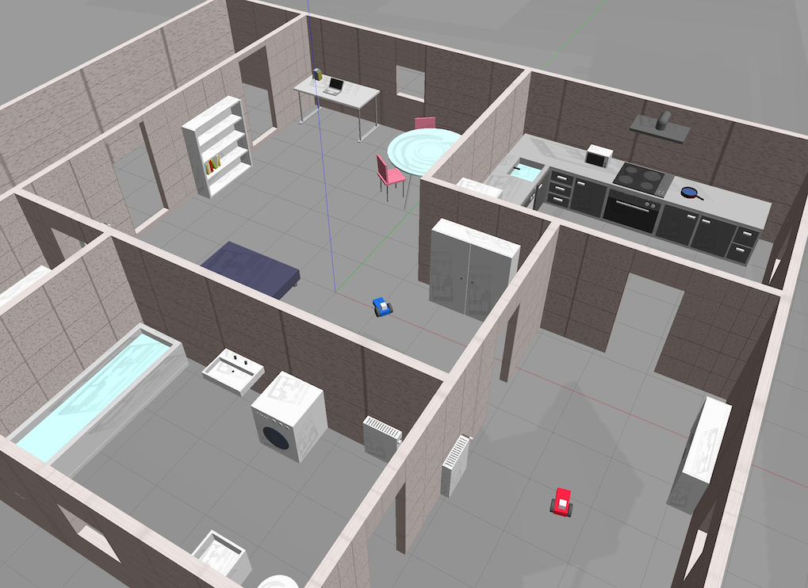
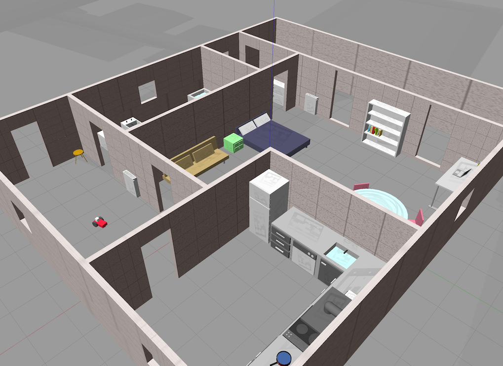
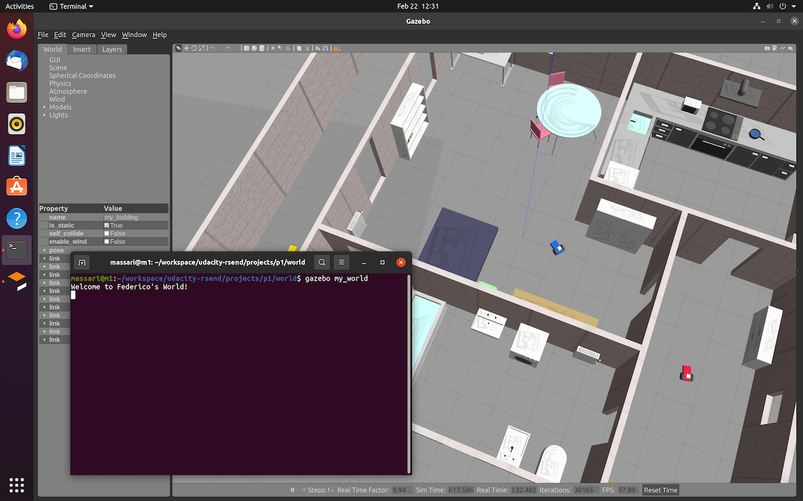
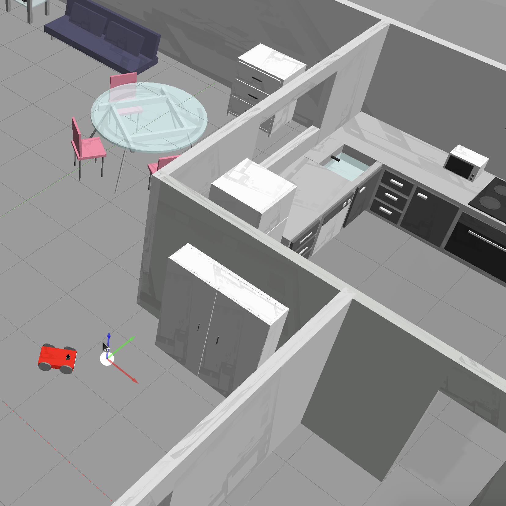
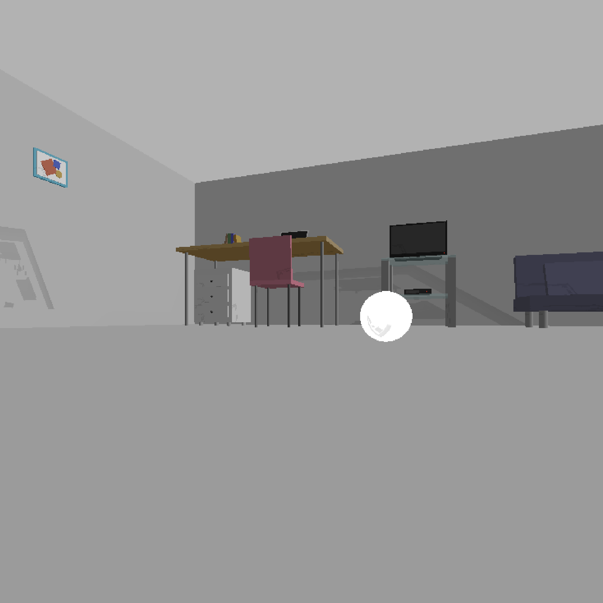

# Udacity Robotics Software Engineer Nanodegree

My Udacity Robotics Software Engineer Nanodegree projects, in C++.

## Environment

* Ubuntu 20.04-5 LTS Focal Fossa running on UTM Virtual Machine on MacBook Pro M1 Max (aarch64)
* ROS Noetic Desktop-Full Install on Ubuntu (<http://wiki.ros.org/noetic/Installation/Ubuntu>)
* Gazebo Classic 11.0 (<https://classic.gazebosim.org/tutorials?tut=install_ubuntu&cat=install>)

# Core Projects

## Project 1: Build My World

__Acquired familiarity with:__ Gazebo, Ubuntu on VM.

### Overview

_Simulate a robotic environment with Gazebo and deploy your robot in it. Create basic C++ plugins that interact with the world._

To build the environment for this initial project, to be completed within the first week of enrollment, I drew inspiration from my current home. All model CADs (computer-aided designs) are created from scratch, building upon the basic components Gazebo provides (cube, cylinder, sphere) and experimenting with colour as well as translation and rotation features. The resulting world is quite realistic and unique, although some components (such as the kitchen block) are a bit heavy.

__[Link to code](/projects/p1)__

<table>
  <tr>
    <td align="center"></td>
    <td align="center"></td>
  </tr>
</table>

### How to Build and Run the Project

We suppose the project resides at address `/home/$whoami/workspace/udacity-rsend/projects/p1`, with `$whoami` the username of the current user (verify on console).

```bash
cd /home/$whoami/workspace/udacity-rsend/projects/p1
mkdir build
cd build/
cmake ../
make
export GAZEBO_PLUGIN_PATH=${GAZEBO_PLUGIN_PATH}:/home/$whoami/workspace/udacity-rsend/projects/p1/build
```

Launch the world file in Gazebo to load both the world and the plugin (on console):

```bash
cd /home/$whoami/workspace/udacity-rsend/projects/p1/world
gazebo my_world
```

### Output

<td align="center"></td>

### Add Custom Models in Gazebo

Add path `/home/$whoami/workspace/udacity-rsend/projects/p1/model` in Gazebo to insert additional instances of the models into the world.

## [Project 2: Go Chase It!](/projects/p2/p2-go-chase-it.md)

__Acquired familiarity with:__ ROS (Robot Operating System), Catkin.

### Overview

_Design a robot, house it inside your custom world, and program it to chase a white ball using ROS._

Since the objective of this project was to chase an object, I designed a brand new world with enough space for a robot to roam around. The four-wheeled robot has a skid-steer design, which makes reaching the target white ball a much easier task. The robot veers and moves towards the object whenever it detects a white pixel {R=255, G=255, B=255}, while it stands still whenever this is not (or it is no longer) the case. The ball-chasing logic is a ROS node in C++.

__[Link to code](/projects/p2/catkin_ws/src)__

<table>
  <tr>
    <td align="center"></td>
    <td align="center"></td>
  </tr>
</table>

### How to Build and Run the Project

Step into folder `catkin_ws` and execute command `catkin_make` to build the project. Follow the instructions in the project README to run.
