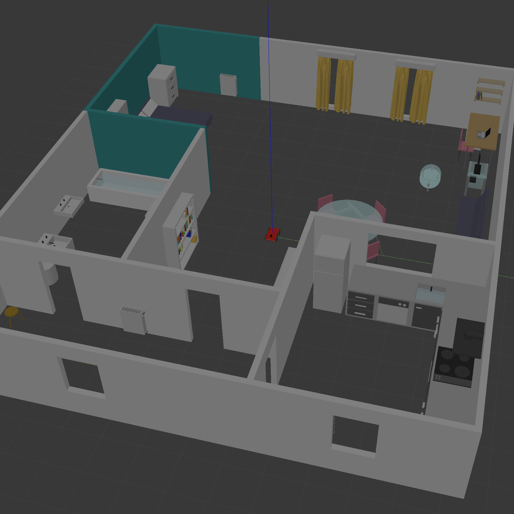

# Udacity Robotics Software Engineer Nanodegree

My Udacity Robotics Software Engineer Nanodegree projects, in C++.

## Environment

* Ubuntu 20.04-5 LTS Focal Fossa running on UTM Virtual Machine on MacBook Pro M1 Max (aarch64)
* ROS Noetic Desktop-Full Install on Ubuntu (<http://wiki.ros.org/noetic/Installation/Ubuntu>)
* Gazebo Classic 11.0 (<https://classic.gazebosim.org/tutorials?tut=install_ubuntu&cat=install>)

# Core Projects

## Project 1: Build My World

__Acquired familiarity with:__ Gazebo, Ubuntu on VM.

### Overview

_Simulate a robotic environment with Gazebo and deploy your robot in it. Create basic C++ plugins that interact with the world._

To build the environment for this initial project, to be completed within the first week of enrollment, I drew inspiration from my current home. All model CADs (computer-aided designs) are created from scratch, building upon the basic components Gazebo provides (cube, cylinder, sphere) and experimenting with colour as well as translation and rotation features. The resulting world is quite realistic and unique, although some components (such as the kitchen block) are a bit heavy.

__[Link to code](/projects/p1)__

<table>
  <tr>
    <td align="center"></td>
    <td align="center"></td>
  </tr>
</table>

### How to Build and Run the Project

We suppose the project resides at address `/home/$whoami/workspace/udacity-rsend/projects/p1`, with `$whoami` the username of the current user (verify on console).

```bash
cd /home/$whoami/workspace/udacity-rsend/projects/p1
mkdir build
cd build/
cmake ../
make
export GAZEBO_PLUGIN_PATH=${GAZEBO_PLUGIN_PATH}:/home/$whoami/workspace/udacity-rsend/projects/p1/build
```

Launch the world file in Gazebo to load both the world and the plugin (on console):

```bash
cd /home/$whoami/workspace/udacity-rsend/projects/p1/world
gazebo my_world
```

### Output

<td align="center"></td>

### Add Custom Models in Gazebo

Add path `/home/$whoami/workspace/udacity-rsend/projects/p1/model` in Gazebo to insert additional instances of the models into the world.

## [Project 2: Go Chase It!](/projects/p2/p2-go-chase-it.md)

__Acquired familiarity with:__ ROS (Robot Operating System), Catkin package management.

### Overview

_Design a robot, house it inside your custom world, and program it to chase a white ball using ROS._

Since the goal of this project was to chase an object, I designed a brand new world with enough space for a robot to roam around. The four-wheeled robot has a skid-steer design, which makes reaching the target white ball a much easier task. The robot veers and moves towards the object whenever it detects a white pixel {R=255, G=255, B=255}, while it stands still whenever this is not (or it is no longer) the case. The ball-chasing logic is a ROS node in C++. See the companion README file for additional information.

__[Link to code](/projects/p2/catkin_ws/src)__

<table>
  <tr>
    <td align="center"></td>
    <td align="center"></td>
  </tr>
</table>

### How to Build and Run the Project

Step into the Catkin workspace and execute `catkin_make` to build the project. Run following the instructions in the dedicated README file.

```bash
cd /home/$whoami/workspace/udacity-rsend/projects/p2/catkin_ws
catkin_make
```

### Output

The Gazebo environment showcasing the ball-chasing logic appears on the LHS of the screen. Received camera images (top) and LiDAR scan (bottom) are on the RHS.


## [Project 3: Where Am I?](projects/p3/p3-where-am-i.md)

### Overview

_Localize your robot based on known map and initial pose using Adaptive Monte Carlo Localization (AMCL)._

In this project, our skid-steer friend is interfaced with the Adaptive Monte Carlo Localization algorithm in ROS so that its position can be estimated as it travels through a predefined set of waypoints in my house. Inclusion of enough, adequately-spaced landmarks or geometric features was necessary for the robot to quickly identify its surroundings and move from start to goal, so I rearranged the furniture in the room and added a brand new coffee table. Calibration of parameters for AMCL and 2d navigation was particularly challenging and is still not perfect even at project completion. Most of the latter step was done in RViz, using the `rqt_reconfigure` plugin to dynamically tune the target variables.

__[Link to code](/projects/p3/catkin_ws/src)__

<table>
  <tr>
    <td align="center"></td>
    <td align="center"></td>
  </tr>
</table>

### How to Build and Run the Project

Change directory to the Catkin folder and build the project. Run following the instructions in the dedicated README file.

### Output

Components for AMCL (arrow particle cloud, LiDAR scan and superimposed map) and 2d navigation (global plan in blue, local plan in green) are displayed in the below RViz window. Notice how quickly the arrow particles converge once the robot successfully localizes itself.


## [Project 4: Map My World](projects/p4/p4-map-my-world.md)

### Overview

_Create 2D occupancy grid and 3D view map in real time using RGB-D SLAM (Kinect-like) with RTAB-Map._

This projects implements simultaneous localization and mapping (SLAM) with ROS. In SLAM, a robot is concerned with the "chicken-and-egg" problem of both mapping out, and localize itself in, an unknown environment at the same time. To perform this task, RTAB-Map (Real-Time Appearance-Based Mapping) is used. Mapping the original home from Project 3 proved too computationally intensive, so I designed a brand new, smaller room with plenty of identifiable features and colours to facilitate loop closure. To reduce distortion in the maps, I made criteria on such loop closures more stringent and fine-tuned extra parameters. The result is an identifiable map of the world.

__[Link to code](/projects/p4/catkin_ws/src/my_robot/)__

<table>
  <tr>
    <td align="center"></td>
    <td align="center"></td>
  </tr>
</table>

### How to Build and Run the Project

Building this project is challenging in ROS Noetic, as a simple `catkin_make` won't do the trick. Follow below steps to ensure correct compilation and run using the instructions in the dedicated README file.

__[Preliminary Configurations](projects/p4/p4-preliminary-config.md)__

### Output

Real-time creation of the 2D occupancy grid (with RViz, top-right corner) and 3D point-cloud map (with RTAB-Map, center) appear in the figure below. The loop closure detection process is visible on the LHS of the screen, top. The robot is manouvered via keyboard teleop (bottom-left).


## [Project 5: Home Service Robot](projects/p5/p5-home-service-robot.md)

### Overview

_Combine SLAM, pure localization, navigation, and programming of ROS nodes in C++ to operate a robot that can autonomously move objects within an environment._

This capstone project builds on the experience gained in previous assignments to deploy a robot that can fetch and deliver items on its own in a Gazebo world. It involves several steps: mapping the environment using SLAM, setting up and fine-tuning the navigation stack, and programming two ROS nodes that can, respectively, impart consecutive goals to the robot and display and hide markers representing object pick-ups and drop-offs. It is the culmination of a rewarding journey in robotics!

__[Link to code](/projects/p5/catkin_ws/src/)__

<table>
  <tr>
    <td align="center"></td>
    <td align="center"></td>
  </tr>
</table>

### How to Build and Run the Project

Ensure `slam_gmapping` and `teleop_twist_keyboard` are installed (ROS Noetic). Then, build via `catkin_make` and run following the instructions in the dedicated README file.

### Output

A simulated pick-up appears in the figure below. The item to fetch is represented by a rotating cyan cube. The robot moves towards the object and a message is displayed once the target is reached. After a few seconds, the object marker is hidden and a final message of successful collection is shown. Also visible in the picture are a rainbow cost cloud depicting the likelihood of traversing a particular region of the map, and a fan-spreading trajectory cloud showing the planned paths the robot will take to reach the goal.


