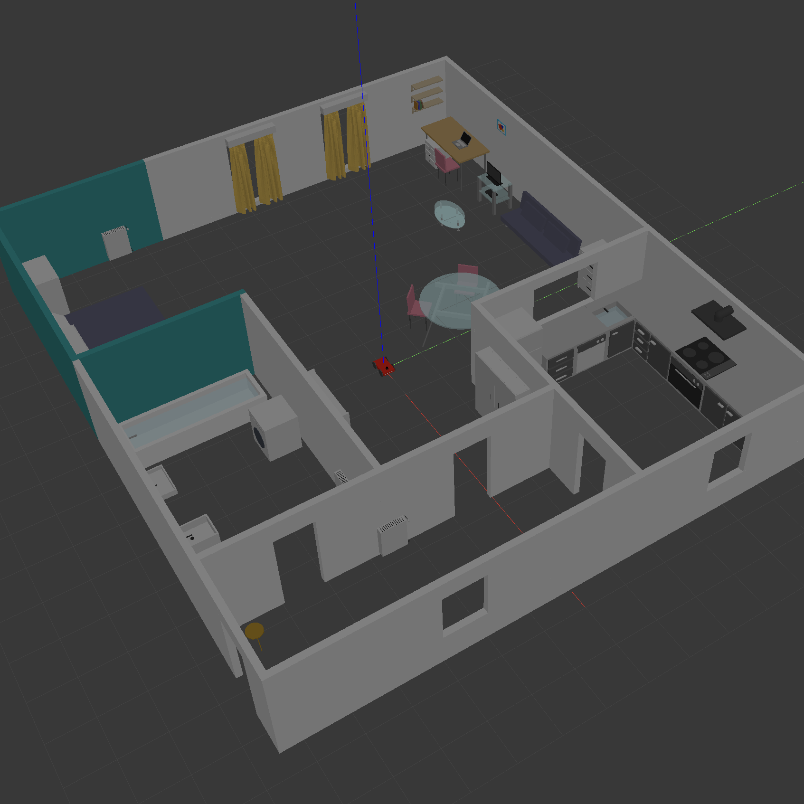
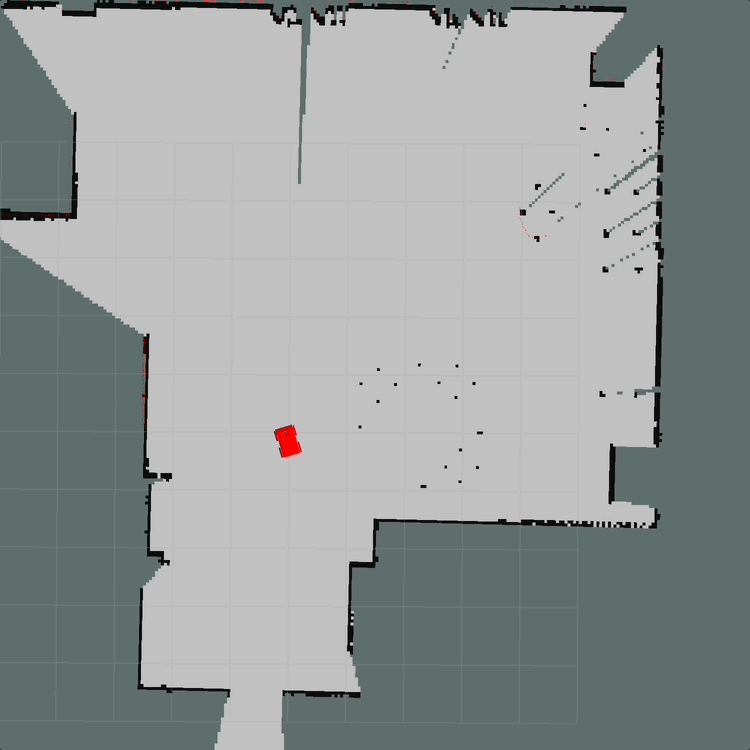
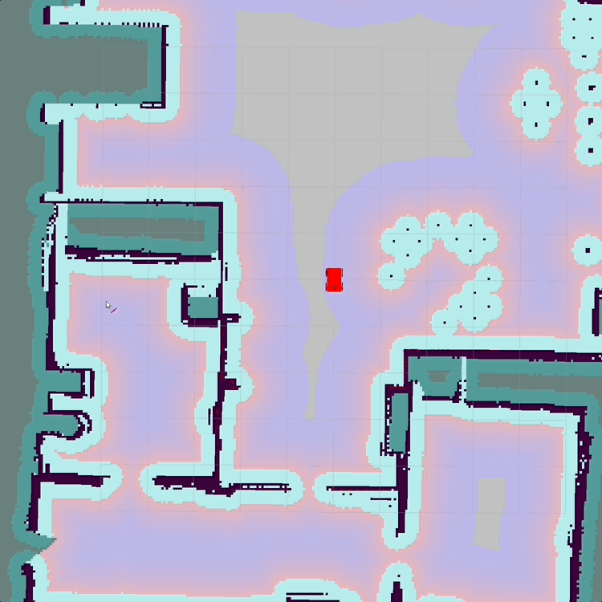
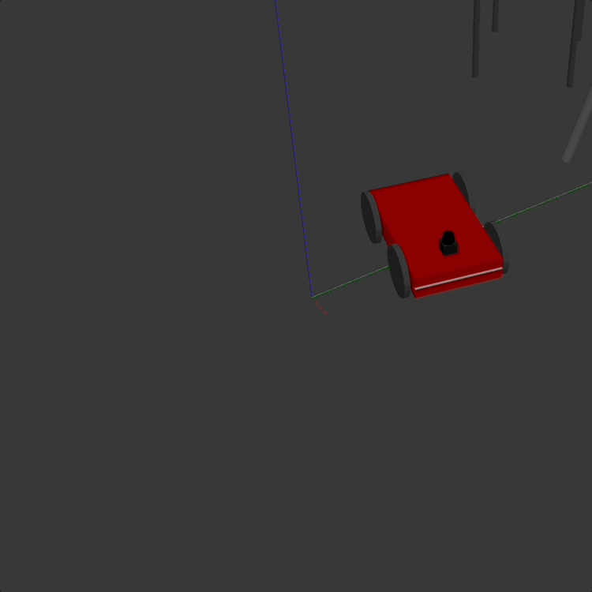
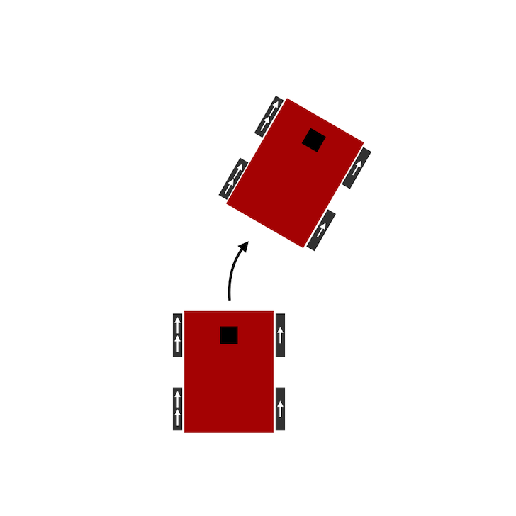
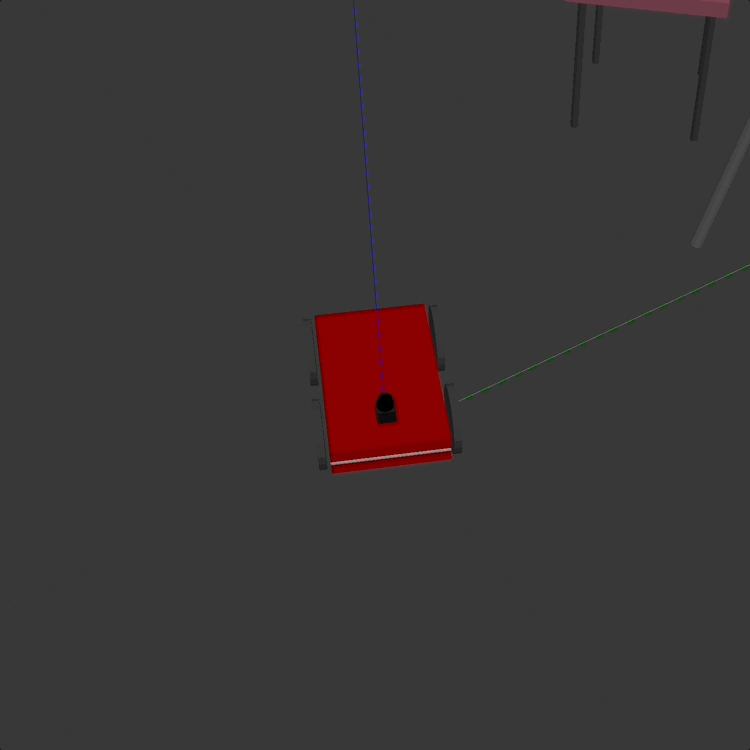
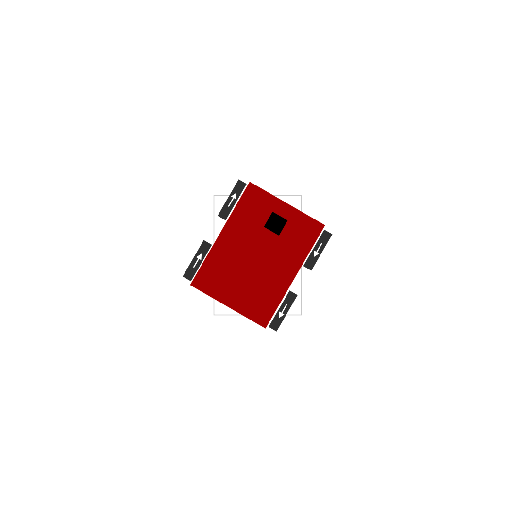

[Home](../../README.md) | Previous: [Home Service Robot](../p5/p5-home-service-robot.md)

# Elective 1: Autonomous Systems Interview Practice

- Path: __Perception/Sensor Engineer__

## Required Question

_Explain a recent project you've worked on. Why did you choose this project? What difficulties did you run into this project that you did not expect, and how did you solve them?_

As a requirement of Udacity's Robotics Software Engineer Nanodegree, I recently deployed a skid-steer robot that could autonomously fetch and deliver items in a Gazebo environment using ROS (Robot Operating System) and C++. The project combined SLAM (Simultaneous Localization and Mapping), navigation, and programming of custom ROS nodes, and was developed in Ubuntu Linux.

While the project itself was not as hard as originally expected thanks to the experience I had gained from working on similar tasks, it still posed some challenges in the design, SLAM, navigation, and Pub/Sub communication phases.

The first challenge was to design a Gazebo world feature-rich enough for robust mapping and localization. In this regard, I decided to reproduce my real home, but this meant I could not rely on stock Gazebo models to populate the environment. All CADs (computer-aided designs) had to be created from scratch, using the basic components Gazebo provides (cube, cylinder, sphere) and experimenting with colour as well as translation and rotation properties. For more complex models (wavy curtains and an oval coffee table) I relied on Blender. The entire process was time-consuming, but the outcome was realistic and very pleasing [Figure 1.A].

Another issue occurred while mapping the environment via SLAM. Even after fine-tuning the parameter values to reduce distortion at loop closure, sketching table and chair legs in the 2D occupancy grid proved surprisingly difficult to complete in one go, since additional passes in the same spots tended to wipe out at least some of the marks left by previous scans [Figure 1.B]. For this reason, for a small portion of the final map I had to take snapshots from various angles through repeated attempts, and then collate the frames in post-processing.

One more challenge, when testing the navigation stack, came from setting the optimal size of the cost cloud used for local planning. With a size too small (side: 1 meter), the robot showed excessive slowness and an occasional off-map behaviour [Figure 2.A]. With a size too large, instead (side: 10 meters), it often got stuck when reaching the same y-coordinate of the goal but in a different room, with the red likelihood area spilling over to the inaccessible space and causing endless recalculation of the ideal trajectory [Figure 2.B]. Through trial and error, I found 6 square meters to be an ideal size.

A final hurdle to overcome was ensuring that the robot would only pick up or drop off an item after reaching the target point. This problem boiled down to efficient communication between a ROS publisher and a subscriber. The node in charge of showing and hiding the object would continuously monitor the odometry topic, and only perform an action when the vector distance of the robot from the target is smaller than a set threshold. Again through trial and error, the optimal distance was found to be approximately 15 centimeters.

<table>
  <tr>
  <td align="center"><b>Figure 1.A</b>: The Gazebo environment</td>
  <td align="center"><b>Figure 1.B</b>: Wiped-out markers in the 2D occupancy grid</td>
  <tr>
  </tr>
  <tr>
    <td align="center"></td>
    <td align="center"></td>
  </tr>
</table>

<table>
  <tr>
  <td align="center"><b>Figure 2.A</b>: Excessive slowness with cost cloud too small (1 sqm)</td>
  <td align="center"><b>Figure 2.B</b>: Indecisiveness with cost cloud too large (10 sqm)</td>
  <tr>
  </tr>
  <tr>
    <td align="center"></td>
    <td align="center"></td>
  </tr>
</table>

#### Follow-up

_You mentioned your robot had a skid-steer design. Can you explain what this means, and how this setup differs from other available options?_

Sure! I am familiar with two classes of mobile robot design, holonomic and non-holonomic. Holonomic robots are free to move across any dimensions in the configuration space, whereas non-holonomic ones are constrained in their movement to some directions only. A robot built entirely on casters (such as spheric wheels) or omni-wheels is a good example of holonomic robot [1]. A skid-steer robot, and its related variant differential drive, are instead non-holonomic.

A skid-steer vehicle usually has four or six wheels (unable to turn), and the wheels on the left side move in sync and independently of those on the right side. Steering is achieved by operating each pair at different speed, causing the robot to slide, or skid [2]. For example, to turn right, the left pair must spin faster than the right one, in the same direction. To rotate in-place, the pairs must move in opposite directions [Figure 3].

A differential drive robot, instead, has two wheels (one on each side, also unable to turn and independent of the other), as well as one or more casters that balance the vehicle and prevent it from tilting [3].

<table>
  <tr>
      <td align="center" colspan="2"><b>Figure 3: Skid-steer robot design</b></td>
  </tr>
  <tr>
  <td align="center"><b>Figure 3.A</b>: Right-turn in Gazebo</td>
  <td align="center"><b>Figure 3.B</b>: Right-turn schematics</td>
  <tr>
  </tr>
  <tr>
    <td align="center"></td>
    <td align="center"></td>
  </tr>
    <tr>
  <td align="center"><b>Figure 3.C</b>: In-place rotation in Gazebo</td>
  <td align="center"><b>Figure 3.D</b>: In-place rotation schematics [4]</td>
  <tr>
  </tr>
  <tr>
    <td align="center"></td>
    <td align="center"></td>
  </tr>
</table>

## Perception/Sensor Engineer Questions

### Question 1

_How do features from algorithms like SIFT, SURF and HOG differ? Explain how these algorithms work, and how you would use them within a perception pipeline._

SIFT, SURF, and HOG are feature extraction and object recognition algorithms used in image processing and computer vision.

SIFT (Scale-Invariant Feature Transform) 

[5], 

reduce image contents to a set of points plus descriptions. find again in other images if same object. Take local neighborhood of a point and create a vector from gradients (change in intensity values) to turn into a descriptor vector. Keypoint in the image, descriptor describes local surrounding around that point. If multiple images, we can find corresponding points and data associations among them.

For visual SLAM, visual odometry, Bag of Words, etc. loop closure.

Keypoints found through DoG approach. Blur image with a Gaussian blur at different magnitudes. The more the blur, the fewer the edges you get. Then you subtract the (with different level of Gaussian blur) blurred images, stack them and look for extrema that stand out.

build an image pyramid with resampling at each level.

Descriptor vector: take local neighborhood, compute gradients (as robust to illumination or viewpoint changes) in small areas, then collect gradients in local regions into histograms

## Resources

1. http://www.robotplatform.com/knowledge/Classification_of_Robots/Holonomic_and_Non-Holonomic_drive.html
2. https://en.wikipedia.org/wiki/Skid-steer_loader
3. https://en.wikipedia.org/wiki/Differential_wheeled_robot
4. https://groups.csail.mit.edu/drl/courses/cs54-2001s/skidsteer.html
5. Lowe, D. G.: Object Recognition from Scale-Invariant Features - [Link](https://www.cs.ubc.ca/~lowe/papers/iccv99.pdf)

[Home](../../README.md) | Previous: [Home Service Robot](../p5/p5-home-service-robot.md)
