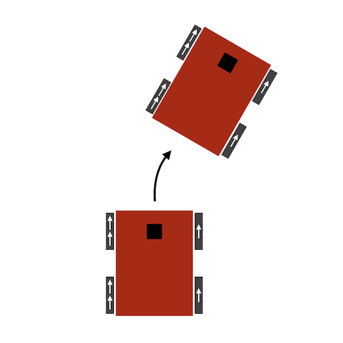
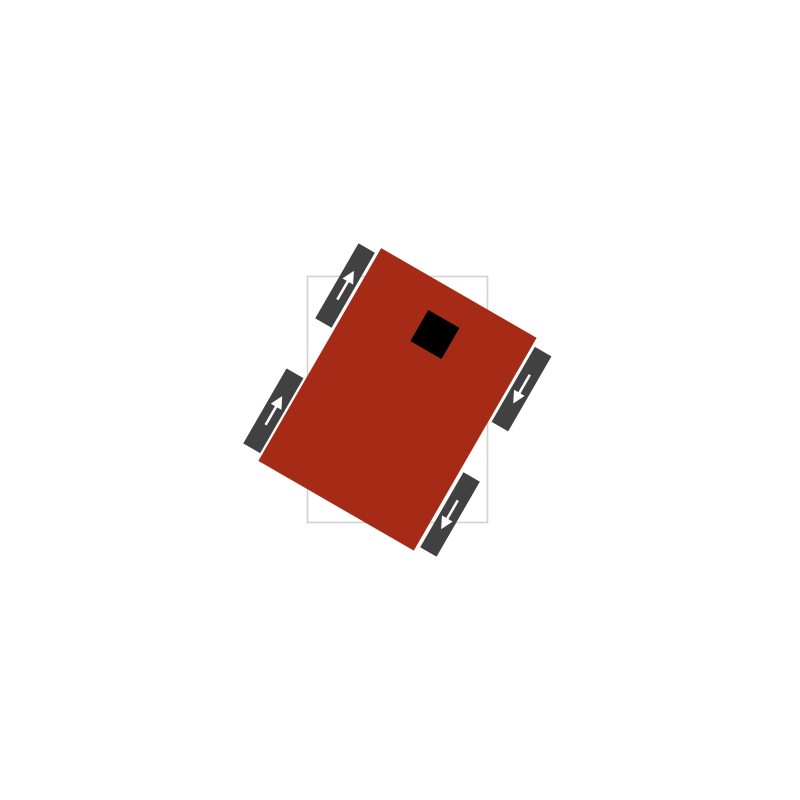

[Home](../../README.md) | Previous: [Home Service Robot](../p5/p5-home-service-robot.md) | Next: [LiDAR Obstacle Detection](https://github.com/federicomariamassari/udacity-sfend/blob/main/projects/p1/p1-lidar-obstacle-detection.md)

# Elective 1: Autonomous Systems Interview Practice

- Path: __Perception/Sensor Engineer__

## Required Question

_Explain a recent project you've worked on. Why did you choose this project? What difficulties did you run into this project that you did not expect, and how did you solve them?_

As a requirement of Udacity's Robotics Software Engineer Nanodegree, I recently deployed a skid-steer robot that could autonomously fetch and deliver items in a Gazebo environment using ROS (Robot Operating System) and C++. The project combined SLAM (Simultaneous Localization and Mapping), navigation, and programming of custom ROS nodes, and was developed in Ubuntu Linux.

While the project itself was not as hard as originally expected thanks to the experience I had gained from working on similar tasks, it still posed some challenges in the design, SLAM, navigation, and Pub/Sub communication phases.

The first challenge was to design a Gazebo world feature-rich enough for robust mapping and localization. In this regard, I decided to reproduce my real home, but this meant I could not rely on stock Gazebo models to populate the environment. All CADs (computer-aided designs) had to be created from scratch, using the basic components Gazebo provides (cube, cylinder, sphere) and experimenting with colour as well as translation and rotation properties. For more complex models ([wavy curtains](https://www.youtube.com/watch?v=h3PIlhh9ruw) and an oval coffee table) I relied on Blender. The entire process was time-consuming, but the outcome was realistic and very pleasing [Figure 1.A].

Another issue occurred while mapping the environment via SLAM. Even after fine-tuning the parameter values to reduce distortion at loop closure, sketching table and chair legs in the 2D occupancy grid proved surprisingly difficult to complete in one go, since additional passes in the same spots tended to wipe out at least some of the marks left by previous scans [Figure 1.B]. For this reason, for a small portion of the final map I had to take snapshots from various angles through repeated attempts, and then collate the frames in post-processing.

One more challenge, when testing the navigation stack, came from setting the optimal size of the cost cloud used for local planning. With a size too small (side: 1 meter), the robot showed excessive slowness and an occasional off-map behaviour [Figure 2.A]. With a size too large, instead (side: 10 meters), it often got stuck when reaching the same y-coordinate of the goal but in a different room, with the red likelihood area spilling over to the inaccessible space and causing endless recalculation of the ideal trajectory [Figure 2.B]. Through trial and error, I found 6 square meters to be an ideal size.

A final hurdle to overcome was ensuring that the robot would only pick up or drop off an item after reaching the target point. This problem boiled down to efficient communication between a ROS publisher and a subscriber. The node in charge of showing and hiding the object would continuously monitor the odometry topic, and only perform an action when the vector distance of the robot from the target is smaller than a set threshold. Again through trial and error, the optimal distance was found to be approximately 15 centimeters.

<table>
  <tr>
  <td align="center"><b>Figure 1.A</b>: The Gazebo environment</td>
  <td align="center"><b>Figure 1.B</b>: Wiped-out markers in the 2D occupancy grid</td>
  <tr>
  </tr>
  <tr>
    <td align="center"></td>
    <td align="center"></td>
  </tr>
</table>

<table>
  <tr>
  <td align="center"><b>Figure 2.A</b>: Excessive slowness with cost cloud too small (1 sqm)</td>
  <td align="center"><b>Figure 2.B</b>: Indecisiveness with cost cloud too large (10 sqm)</td>
  <tr>
  </tr>
  <tr>
    <td align="center"></td>
    <td align="center"></td>
  </tr>
</table>

#### Follow-up

_You mentioned your robot had a skid-steer design. Can you explain what this means, and how this setup differs from other available options?_

Sure! I am familiar with two classes of mobile robot design, holonomic and non-holonomic. Holonomic robots are free to move across any dimensions in the configuration space, whereas non-holonomic ones are constrained in their movement to some directions only. A robot built entirely on casters (such as spheric wheels) or omni-wheels is a good example of holonomic robot [1]. A skid-steer robot, and its related variant differential drive, are instead non-holonomic.

A skid-steer vehicle usually has four or six wheels (unable to turn), and the wheels on the left side move in sync and independently of those on the right side. Steering is achieved by operating each pair at different speed, causing the robot to slide, or skid [2]. For example, to turn right, the left pair must spin faster than the right one, in the same direction. To rotate in-place, the pairs must move in opposite directions [Figure 3].

A differential drive robot, instead, has two wheels (one on each side, also unable to turn and independent of the other), as well as one or more casters that balance the vehicle and prevent it from tilting [3].

<table>
  <tr>
      <td align="center" colspan="2"><b>Figure 3: Skid-steer robot design</b></td>
  </tr>
  <tr>
  <td align="center"><b>Figure 3.A</b>: Right-turn in Gazebo</td>
  <td align="center"><b>Figure 3.B</b>: Right-turn schematics</td>
  <tr>
  </tr>
  <tr>
    <td align="center"></td>
    <td align="center"></td>
  </tr>
    <tr>
  <td align="center"><b>Figure 3.C</b>: In-place rotation in Gazebo</td>
  <td align="center"><b>Figure 3.D</b>: In-place rotation schematics [4]</td>
  <tr>
  </tr>
  <tr>
    <td align="center"></td>
    <td align="center"></td>
  </tr>
</table>

## Perception/Sensor Engineer Questions

### Question 1

_What are some of the advantages and disadvantages of cameras, LiDAR and radar? What combination of these (and other sensors) would you use to ensure appropriate and accurate perception of the environment?_

Camera, LiDAR, and radar are all important sensors that help us get an understanding of the world surrounding us in different ways and are, therefore, complementary.

__Cameras__ are passive sensors which generate high-resolution images from ambient light reflecting off of objects into the camera lens. They are relatively cheap and widespread, and because they see the world as we see it, they are unique in their ability to capture and interpret 2D information (e.g., road signs and lane markings) and colour (e.g., traffic lights), which are important in object recognition and classification tasks. For this reason, however, cameras are subject to the same drawbacks that affect the human eye: they perform poorly under bad weather conditions such as fog or heavy rain, darkness (although they are getting increasingly sophisticated at night vision), and extreme light or glare, such as snow reflection. Mono cameras are also unable to measure distance and velocity of a target from a single picture; to do so, one can rely on a stereo setup or compare matched features' heights across consecutive frames, but the process is computationally expensive and, in the case of stereo cameras, also costly.

__LiDAR__ (Light Detection And Ranging) is commonly used as a way to accurately measure distances and create detailed 3D maps of the surrounding environment. LiDAR targets surfaces with laser beams (photon pulses of a few nanoseconds) and measures the time it takes for the beams to bounce back; when surfaces are hit, Point Cloud Data (PCD) are generated. LiDAR excels at tracking position, shape, and depth of objects, and the clouds of points it returns can be processed using algorithms such as RanSaC (Random Sample Consensus) and Euclidean clustering, and grouped into bounding boxes. It is, however, a very pricey sensor (a unit could cost up to $100,000), it cannot measure velocity directly, and due to its short wavelength, it fails in bad weather conditions such as heavy rain or hail.

__Radar__ (Radio Detection And Ranging) propagates electromagnetic waves into the environment, and these waves are reflected back to the sensor if an object is found. The difference between the transmitted and the received radar signals is the beat frequency, which is used to infer a target's radial distance _rho_ ($\rho$), bearing or azimuth _phi_ ($\phi$) [5], and radial velocity _rho dot_ ($\dot{\rho}$) via signal processing. Radar is the only sensor that can estimate velocity in a single pass (based on Doppler effect). It is unaffected by darkness, and highly accurate in adverse weather conditions like heavy rain or fog thanks to its longer wavelength, which is not easily absorbed or deflected by those atmospheric phenomena. Finally, radar is now very cheap (~$100), robust, and compact, as it can easily fit under the grille of a car. The main drawback or radar is its low resolution imaging (it cannot determine the shape of objects), which makes it unsuitable for classification tasks, unlike camera and LiDAR.

In my view, the complementary nature of the above sensors makes it important to rely on all of them, possibly in multiple units, to ensure an accurate perception of the environment. For example, inexpensive cameras and radars (both short- and long- range) could be placed on all sides of an ego vehicle to give a 360° perspective on its surroundings (complete 2D imaging, speed of nearby cars), while LiDAR could sit atop of ego (rotating scanner) or even on flanks (MEMS scanning mirrors version, [6]) (highly-detailed 3D maps). To this stack of sensors, I would also add an __IMU__ (Inertial Measurement Unit) [7] for motion tracking and orientation estimation.

The adoption of multiple units of the same or different sensors is called _redundancy_, and this concept is key in order to enhance the safety and reliability of an autonomous agent. Redundancy enables cross-verification of data from different sources, which mitigates the risk of inaccuracies or errors in case one or more sensors fail under certain conditions (e.g., poor visibility, damage due to bumps). Paired with a robust sensor fusion algorithm and a failure-detection mechanism, redundancy would greatly help reduce uncertainty and lower the risk of incidents.

#### Follow-up

_If you had to design a budget-friendly autonomous system (robot, self-driving car, or UAV), would you still include LiDAR in your stack of sensors?_

### Question 2

__[Code]__ _3D point clouds are sometimes processed into "voxels" as one step into object detection. What is a voxel, what is the process behind converting point cloud data into voxels (code this), and why would we want to perform this step with our point cloud data?_

Reducing the density of a point cloud is essential in applications that require real-time handling of data, such as SLAM or collision avoidance in self-driving cars. The "voxel grid" technique helps achieve this purpose by downsampling, hence simplifying, the input cloud, optimizing data storage and processing requirements.

A voxel (short for volumetric pixel) is a cube that encapsulates and represents a single point in the three-dimensional space. The raw point cloud is divided into a cubic grid, and all points belonging to a particular cube are proxied by their centroid, a unique point with coordinates the means of all coordinates of the enclosed points: filtering is thus obtained by replacing the cloud of points in each cube [Figure 4.A] with the corresponding centroid [Figure 4.B].

<table>
  <tr>
  <td align="center"><b>Figure 4.A</b>: Input Point Cloud</td>
  <td align="center"><b>Figure 4.B</b>: Voxel Grid Filtering</td>
  <tr>
  </tr>
  <tr>
    <td align="center"></td>
    <td align="center"></td>
  </tr>
</table>

[`voxel.cpp`](https://github.com/federicomariamassari/udacity-rsend/blob/main/projects/e1/src/voxel.cpp) contains an example of voxel grid filtering using Point Cloud Library (PCL). We first generate 1000 uniformly-distributed points in the 3D space and push them back in a point cloud structure. The points' coordinates are in the interval $[0; 4]$ cm, so the enclosing cube is anchored to the origin $(0, 0, 0)$. We then set the side of the voxel to 2 cm, which subdivides the wireframe into 8 smaller cubes (the voxels' boundaries), each containing ~125 points. One sample cube is colored magenta. We finally perform the filtering, which swaps all points in each smaller cube with a single centroid, and push the results (8 points) into a new cloud.

#### How to Build and Run

Required dependencies are CMake 2.8+, Point Cloud Library 1.11 ([built from source](https://pcl.readthedocs.io/projects/tutorials/en/latest/compiling_pcl_posix.html#stable)), and Eigen. If you opt for cloning the repository:

```bash
cd /home/$whoami/workspace/udacity-rsend/projects/e1
mkdir build && cd build
cmake ..
make
./voxel
```

The directory structure tree is as follows:

```bash
.
├── build
│   ├── ...
│   └── voxel
├── CMakeLists.txt
└── src
    ├── voxel.cpp
    └── voxel.h
```

#### Follow-up (suggested by Udacity GPT)

_How does the voxel size affect the accuracy and efficiency of object detection?_

Choosing the right voxel size is a balancing act between accurate object detection and computational efficiency. Smaller voxels tend to be quite expensive but allow for more precise tracking because they retain more details (higher resolution) as fewer points need to be proxied by their corresponding centroid: tiny object would have a chance to be preserved, while larger ones would be more nuanced. Larger voxels, on the contrary, are cheaper since fewer points are kept, but they may lead to significant loss of detail, to the point of completely changing the shape of the original object. This problem is particularly serious in LiDAR obstacle detection for self-driving cars, in which being unable to accurately assess the boundaries of an incoming vehicle greatly raises the risk of collision.

In general, if an input point cloud is uniformly spread out within a cube, and we set the voxel leaf size to be $\frac{1}{n}$-th the length of the cube side, we will preserve, after filtering, $n^3$ centroids, so the larger the value of $n$, the more points are kept. Considering a 10-centimeter cube with 1000 uniformly-distributed 3D points, a voxel size of 2 centimeters ($\frac{1}{5}$) will retain $5^3 = 125$ out of the original 1000 points, whereas one of 5 centimeters ($\frac{1}{2}$) will only preserve of $2^3 = 8$ of them.

### Question 3

__[Code]__ _What approach would you take if the various sensors you are using have different refresh rates?_

There are several ways to handle measurements from sensors with different refresh rates. Popular approaches are:

- Data imputation (e.g., interpolation, extrapolation, fill-forward)
- Buffering
- Sensor fusion techniques (e.g., various flavours of Kálmán Filter)

__Imputation.__ This is the process of replacing missing data with substituted values [9], and the goal is to ensure that, for all the timestamps coming from the various sensors, an observation is always available for each sensor. We can distinguish among interpolation, extrapolation, and fill-forward.

_Interpolation_ (linear, spline) allows to estimate the value of an intermediate point based on two endpoints. For example, if data from camera refreshes at time $t$ and $t+2$, and data from LiDAR does so at $t+1$, one can (linearly) interpolate the camera value at $t+1$ via [10]:

$$
y_{t+1} = y_t + (y_{t+2} - y_t) \times \frac{x_{t+1}-x_t}{x_{t+2}-x_t}
$$

with $x$ the timestamp and $y$ the corresponding data point from camera. Because interpolation requires two endpoints (one in the past, the other in the future), I would argue that, to prevent delays, this technique is mainly used in post-processing, when the entire history of the sensors is available and one just needs to fill the gaps.

_Extrapolation_ [11] allows to infer the future value of an observation based on a single endpoint (usually, the most recent entry) and a model calibrated on some history of the data. For instance, if we are at $t+2$ and expect LiDAR to produce a data point at $t+3$, while camera only at $t+4$, we can estimate the camera value in advance, so when $t+3$ comes, entries for both sensors will be at hand. Extrapolation could be used in real-time applications if the data point to predict is not too far into the future, and the estimate relies on a model that is lightweight in terms of assumptions and computational complexity.

_Fill-forward_ simply fills out any missing entries with the most recent available data point. In the camera example, the sensor value at time $t+2$ would be extended to $t+3$. Fill-forward is plausible when speed is of essence, but often too simplistic for real-world scenarios.

__Buffering.__ While imputation focuses on "catching up" with the fastest sensor, buffering involves matching the slower sensor by storing the data from the former into a buffer, until the latter is ready to process them. In this case, the camera value at $t$ could be buffered until $t+1$, when the LiDAR observation becomes available, and then released. Similarly, the value at $t+2$ could be stored until $t+3$, and so on.

__Sensor Fusion Techniques.__ The most reliable way to deal with measurements from sensors with different refresh rates is via sensor fusion algorithms such as Kálmán filters (parametric) or particle filtering (non-parametric). These methods incorporate asynchronous data points as they arrive, in a series of predict and update steps that make the estimation of the state of the system being tracked increasingly sound.

[`ukf.cpp`](https://github.com/federicomariamassari/udacity-rsend/blob/main/projects/e1/src/ukf.cpp) showcases the Unscented Kálmán Filter (UKF).

#### Follow-up

## Resources

1. http://www.robotplatform.com/knowledge/Classification_of_Robots/Holonomic_and_Non-Holonomic_drive.html
2. https://en.wikipedia.org/wiki/Skid-steer_loader
3. https://en.wikipedia.org/wiki/Differential_wheeled_robot
4. https://groups.csail.mit.edu/drl/courses/cs54-2001s/skidsteer.html
5. https://en.wikipedia.org/wiki/Bearing_(angle)
6. Yoo _et al._, [MEMS-based lidar for autonomous driving](https://publik.tuwien.ac.at/files/publik_273071.pdf), 2018, Elektrotechnik und Informationstechnik
7. https://en.wikipedia.org/wiki/Inertial_measurement_unit
8. You _et al._, [Pseudo-LiDAR++: Accurate Depth for 3D Object Detection in Autonomous Driving](https://arxiv.org/pdf/1906.06310.pdf), 2020, ICLR
9. https://en.wikipedia.org/wiki/Imputation_(statistics)
10. https://en.wikipedia.org/wiki/Interpolation
11. https://en.wikipedia.org/wiki/Extrapolation

[Home](../../README.md) | Previous: [Home Service Robot](../p5/p5-home-service-robot.md) | Next: [LiDAR Obstacle Detection](https://github.com/federicomariamassari/udacity-sfend/blob/main/projects/p1/p1-lidar-obstacle-detection.md)
