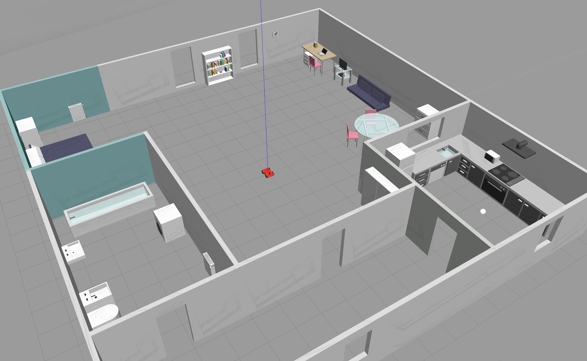
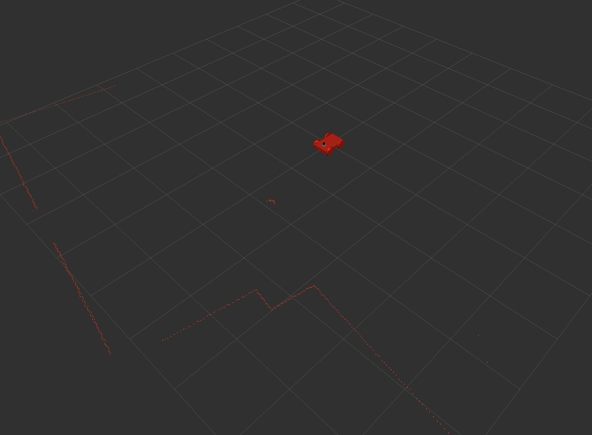

# Project 2: Go Chase It!

```bash
.
└── catkin_ws
    └── src
        ├── ball_chaser
        │   ├── CMakeLists.txt
        │   ├── launch
        │   │   └── ball_chaser.launch
        │   ├── package.xml
        │   ├── src
        │   │   ├── drive_bot.cpp
        │   │   └── process_image.cpp
        │   └── srv
        │       └── DriveToTarget.srv
        └── my_robot
            ├── CMakeLists.txt
            ├── launch
            │   ├── robot_description.launch
            │   └── world.launch
            ├── meshes
            │   └── hokuyo.dae
            ├── my_robot_config.rviz
            ├── package.xml
            ├── urdf
            │   ├── my_robot.gazebo
            │   └── my_robot.xacro
            └── worlds
                ├── empty.world
                └── my_new_world.world
```

## Setup

### First Terminal

```bash
roscore
```

### Second Terminal

```bash
source devel/setup.bash
roslaunch ball_chaser ball_chaser.launch
```

### Third Terminal

```bash
source devel/setup.bash
roslaunch my_robot world.launch
```

### Fourth Terminal

```bash
source devel/setup.bash
rosrun rqt_image_view rqt_image_view
```

<table>
  <tr>
    <td align="center"></td>
  </tr>
</table>

`my_robot_config.rviz` inside `/home/$whoami/workspace/catkin_ws/src/my_robot`.

<table>
  <tr>
    <td align="center"></td>
  </tr>
</table>
