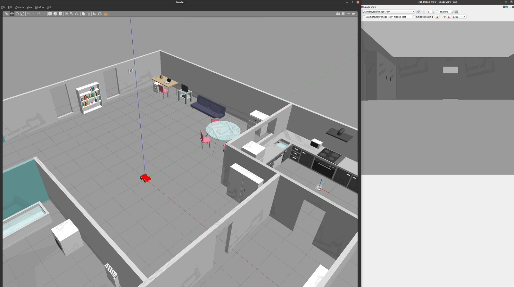

[Home](../../README.md) | Next: [Where Am I?](../p3/p3-where-am-i.md)

# Project 2: Go Chase It!

## Overview

For this project, my very first using ROS (the Robot Operating System), I created a brand new robot, housed it in a redesigned Gazebo world, and coded a C++ node to allow the robot to chase detected white balls inside the environment [Figure 1].

The node implements all steps of an autonomous system: perception, decision making, and actuation. The robot continuously receives image data (perception), decides whether and where to move based of what it sees (decision making) and, finally, performs the action (actuation).

To ease the task of roaming around, I made the Gazebo world built in the previous project much wider. I also refined some of its existing models (for example, I added transparency to glass surfaces) and created additional ones. The world is now much closer to my home in the real world.

__Figure 1: The Ball-Chasing Robot__


## Project Structure

The directory structure tree [1] for the project appears in Figure 2. `catkin_ws` is the Catkin workspace, the top-level directory where packages are managed; it includes two of them:

* `ball_chaser`, which contains the ball-chasing logic (white pixel detection and robot motion);
* `my_robot`, which holds the robot design (URDF: Unified Robot Description Format), the Gazebo world, and the launch and configuration files.

__Figure 2: Directory Structure Tree__

```bash
.
└── catkin_ws
    └── src
        ├── ball_chaser
        │   ├── CMakeLists.txt
        │   ├── launch
        │   │   └── ball_chaser.launch
        │   ├── package.xml
        │   ├── src
        │   │   ├── drive_bot.cpp
        │   │   └── process_image.cpp
        │   └── srv
        │       └── DriveToTarget.srv
        └── my_robot
            ├── CMakeLists.txt
            ├── config
            │   └── ball_chaser_config.rviz
            ├── launch
            │   ├── robot_description.launch
            │   └── world.launch
            ├── meshes
            │   └── hokuyo.dae
            ├── package.xml
            ├── urdf
            │   ├── my_robot.gazebo
            │   └── my_robot.xacro
            └── worlds
                ├── empty.world
                └── my_new_world.world
```

## Building the Project

With `catkin_ws` as current directory, run:

```bash
catkin_make
```

Among the others, this command will create folders `build` and `devel`, the latter containing the `setup.bash` script which you may need to source in each new terminal window in order to run ROS-related statements.

## Running the Project

To run the project you would need multiple open terminals; later in Project 3, all commands will be added to a single `.launch` file to minimize inconveniences.

### First Terminal

```bash
roscore
```

You must have `roscore` running in order for ROS nodes to interact. This step is recommended even though it can be bypassed if the `roslaunch` command is invoked (as the latter also calls `roscore` under the hood). Among the other tasks, `roscore` will start up:

* The __ROS Master__, which manages and maintains a registry of all active nodes on a system, and allows them to locate one another and communicate via message passing (Topics: Pub/Sub) and through services (Services: Request/Response);

* A __Parameter Server__ (hosted by the ROS Master), which stores parameter and configuration values shared among the running nodes.

### Second Terminal

```bash
source devel/setup.bash
roslaunch ball_chaser ball_chaser.launch
```

The last command will trigger the ball-chasing logic comprising a client node that subscribes to, and analyzes, the robot's camera images, and a server node that publishes to the robot's wheels and drives the robot around if a white ball is detected. The node will be waiting for incoming data until the Gazebo world, containing our little friend, is spawned.

### Third Terminal

```bash
source devel/setup.bash
roslaunch my_robot world.launch
```

This will launch the Gazebo world [Figure 3], the robot at the origin (x=0, y=0, z=0), and the RViz (ROS Visualization) widget with custom configuration based on below line from `world.launch`:

```xml
<node name="rviz" pkg="rviz" type="rviz" respawn="false" args="-d $(find my_robot)/config/ball_chaser_config.rviz"/>
```

In RViz a camera view, the robot, and a lidar point-cloud scan will appear on the screen [Figure 4]. Also, for each camera image received the `ball_chaser` node will now start publishing velocities to the robot's wheels (check the output on the second terminal).

__Figure 3: The Gazebo World Holding the Robot__


__Figure 4: The Camera View and Lidar Point-Cloud Scan in RViz__


### Fourth Terminal

```bash
source devel/setup.bash
rosrun rqt_image_view rqt_image_view
```

This command will spawn an additional instance of the camera view, but easier to handle than the one embedded in RViz.

## Code Logic

### RQt Graph

The RQt (ROS Qt "cute" framework) graph for the project appears in Figure 5. To reproduce the same, run below commands in an additional terminal instance:

```bash
source devel/setup.bash
rosrun rqt_graph rqt_graph
```

Then, once inside the GUI, set "Nodes/Topics (all)", "Group" equal to 1 (to nest Namespace boxes once), and unhide `/tf` (Transformation Tree).

__Figure 5: RQt Graph__


### Nodes

The `ball_chaser` package has two C++ nodes:

* Client node `/process_image` subscribes to the robot's camera images `/camera/rgb/image_raw` ([code](https://github.com/federicomariamassari/udacity-rsend/blob/main/projects/p2/catkin_ws/src/ball_chaser/src/process_image.cpp#L92)), analysing each of them to determine the position of the white ball. Once such position is determined, the client requests service `/ball_chaser/command_robot` ([code](https://github.com/federicomariamassari/udacity-rsend/blob/main/projects/p2/catkin_ws/src/ball_chaser/src/process_image.cpp#L89)) to drive the robot left, center, or right;

* Server node `/drive_bot` provides service `/ball_chaser/command_robot` ([code](https://github.com/federicomariamassari/udacity-rsend/blob/main/projects/p2/catkin_ws/src/ball_chaser/src/drive_bot.cpp#L45)) to drive the robot around controlling its linear x and angular z velocities. The service publishes a message containing the velocities to the wheel joints through the `/cmd_vel` topic ([code](https://github.com/federicomariamassari/udacity-rsend/blob/main/projects/p2/catkin_ws/src/ball_chaser/src/drive_bot.cpp#L42)).

### Image Processing

Topic `/camera/rgb/image_raw` publishes the (uncompressed) images as contents of message `sensor_msgs/Image.msg`. Each image is then received by the client and passed to callback function `process_image_callback` ([code](https://github.com/federicomariamassari/udacity-rsend/blob/main/projects/p2/catkin_ws/src/ball_chaser/src/process_image.cpp#L31)), which holds the ball-chasing logic.

From the [official API](https://docs.ros.org/en/noetic/api/sensor_msgs/html/msg/Image.html) documentation for `sensor_msgs/Image.msg` an image is a matrix of byte data with total size $rows \times step$. $step$ is 3 times the number of columns because each column holds three bytes forming an RGB pixel (the first one being at the top-left corner of the picture). Since the ball is the only purely white {R=255, G=255, B=255} object in the world, the robot moves if and only if any of the ball's pixels come into its sight, and stands still (or halts) otherwise. In the code, the screen is divided into three vertical sections (left, middle, right) and the robot veers accordingly depending on which side of the screen the ball is detected [Figure 6].

__Figure 6: Ball Detection and Chasing__


### Robot Mechanics

Robot configurations are included in folder `urdf`. The robot has a _skid-steer_ design, as opposed to the default _differential drive_. In skid-steer, a balancing caster is replaced by two driving wheels. The robot has therefore four wheels, the ones on the left (moving in sync) being autonomous from those of the right (also in sync). This setup allows for higher stability, more refined movement, and the ability of turning in place.

## Resources

1. Install via `sudo apt install tree` (Ubuntu), then step into the desired directory and run `tree`.

[Home](../../README.md) | Next: [Where Am I?](../p3/p3-where-am-i.md)