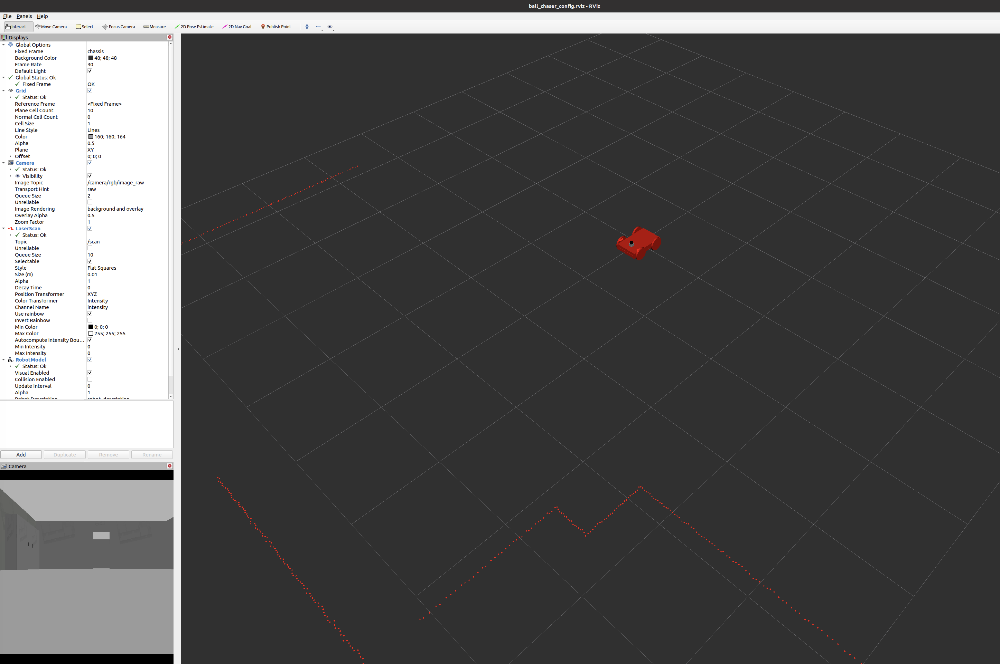

# Project 2: Go Chase It!

Perception, decision making, actuation.

__Figure 1: The Ball-Chasing Robot__


## Project Structure

Below is the directory structure tree [1] for the project. `catkin_ws` is the Catkin workspace, the top-level directory where packages are managed. This project includes two packages: `ball_chaser`, which contains  the ball-chasing logic (white pixel detection and robot motion), and `my_robot`, which holds the robot design (URDF: Unified Robot Description Format), the Gazebo world, as well as launch and configuration files.

```bash
.
└── catkin_ws
    └── src
        ├── ball_chaser
        │   ├── CMakeLists.txt
        │   ├── launch
        │   │   └── ball_chaser.launch
        │   ├── package.xml
        │   ├── src
        │   │   ├── drive_bot.cpp
        │   │   └── process_image.cpp
        │   └── srv
        │       └── DriveToTarget.srv
        └── my_robot
            ├── CMakeLists.txt
            ├── launch
            │   ├── robot_description.launch
            │   └── world.launch
            ├── meshes
            │   └── hokuyo.dae
            ├── my_robot_config.rviz
            ├── package.xml
            ├── urdf
            │   ├── my_robot.gazebo
            │   └── my_robot.xacro
            └── worlds
                ├── empty.world
                └── my_new_world.world
```

## Building the Project

Step into `catkin_ws` and run:

```bash
catkin_make
```

Among the others, this will create folders `build` and `devel` - the latter containing `setup.bash`, which you may need to source in each new terminal window in order to run ROS-related commands.

## Running the Project

You would need multiple open terminals to run this project:

### First Terminal

```bash
roscore
```

You must have `roscore` running in order for ROS nodes to interact. This step is recommended even though it can be bypassed if the `roslaunch` command is invoked (as the latter also calls `roscore` under the hood). Among the others, `roscore` will start up:

- The __ROS Master__, which manages and maintains a registry of all active nodes on a system, and allows them to locate one another and communicate via message passing (Topics: Pub/Sub) and through services (Services: request/response);

- A __Parameter Server__ (hosted by the ROS Master), which stores parameter and configuration values shared among the running nodes.

### Second Terminal

```bash
source devel/setup.bash
roslaunch ball_chaser ball_chaser.launch
```

This last command will trigger the ball-chasing logic comprising a client node that subscribes to, and analyzes, the robot's camera images, and a server node that publishes to the robot's wheels and drives the robot around if a white ball is detected. The node will be waiting for incoming data until the Gazebo world containing our little friend is spawned.

### Third Terminal

```bash
source devel/setup.bash
roslaunch my_robot world.launch
```

This will launch the Gazebo world, the robot at coordinates (x=0, y=0, z=0), and the RViz visualization widget. To setup RViz, click on "File" > "Open Config (Ctrl+O)" and locate `my_robot_config.rviz` (inside `my_robot` directory): a camera view, the robot, and a lidar point-cloud scan will appear on the screen. Also, for each camera image received the `ball_chaser` node will now start publishing velocities to the robot's wheels (check the output on the second terminal).

### Fourth Terminal

```bash
source devel/setup.bash
rosrun rqt_image_view rqt_image_view
```

This command will spawn an additional instance of the camera view, but easier to handle than the one embedded in RViz.

__Figure 2: The Gazebo World__


__Figure 3: The Lidar Point-Cloud Scan in RViz__


# Resources

1. Install via `sudo apt install tree` (Linux), then step into the desired directory and run `tree`.
