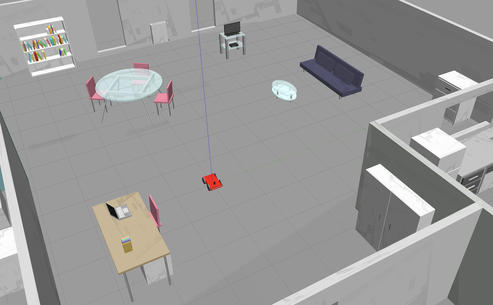

[Home](../../README.md) | Previous: [Go Chase It!](../p2/p2-go-chase-it.md)

# Project 3: Where Am I?

__Figure 1: The Rearranged Environment__

## Parameter Configuration

### AMCL

<table>
    <thead>
        <tr>
            <th>Type</th>
            <th>Parameter</th>
            <th>Value</th>
            <th>Explanation</th>
        </tr>
    </thead>
    <tbody>
        <tr>
            <td rowspan=1>Overall Filter Parameters</td>
            <td><code>odom_model_type</code></td>
            <td><code>diff</code></td>
            <td>Adopted for skid-steer robots [2].</td>
        </tr>
        <tr>
            <td rowspan=1>Laser Model Parameters</td>
        </tr>
        <tr>
            <td rowspan=1>Odometry Model Parameters</td>
        </tr>
    </tbody>
</table>

### Move Base

__Figure 2: Global and Local Costmaps__

## Resources

[1] Zheng, Kaiyu: "ROS Navigation Tuning Guide" (2019 revision)

[2] McLeod, Haidyn: "ROS Localization and Navigation using Gazebo" (2018)
