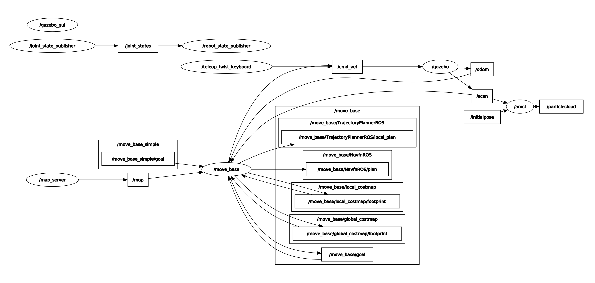

[Home](../../README.md) | Previous: [Go Chase It!](../p2/p2-go-chase-it.md)

# Project 3: Where Am I?

## Overview

This third project combines localization and 2D navigation.

__Localization__ is a robot's ability to establish its own position and orientation using a known map of an environment, laser scan, and  odometry data [1]. In this assignment, the robot is interfaced with the Adaptive Monte Carlo Localization (AMCL) algorithm, which uses a dynamically-adjusting particle filter representing a distribution of likely states for the robot. AMCL is widely used in robotics due to its computational efficiency: the robot reduces the number of total particles as it navigates the environment, senses its objects via LiDAR, and becomes more confident about its position; otherwise it generates, and gives weight to, more particles in random places.

__2D navigation__ is the ability to produce a safe path from start to goal for the robot to execute, based on odometry and sensor data, as well as local and global costmaps [2].

A plethora of parameters exists to calibrate, in order to improve the outcome for both exercises. Tuning is, however, a very challenging task (literature agrees): it took several days of trial-and-error to reach a satisfactory, but not perfect, result at project submission.

Also, since inclusion of a good number of adequately-spaced landmarks was necessary for the robot to quickly orient itself and safely move from place to place, I rearranged the furniture in the Gazebo environment from Project 2 [Figure 1].

__Figure 1: The Rearranged Environment__


## Project Structure

Figure 2 highlights the directory structure tree for the project. Particularly relevant are file `amcl.launch` and folder `config` holding, respectively, calibrated parameters for AMCL and 2D planning. Also, `maps` contains the environment map required for localization and generated via `pgm_map_creator`. This package __does not__ work with ROS Noetic, so the map was generated online in the provided Udacity workspace, and later downloaded for use in my virtual machine. The map is a bird-eye view of the room, so it did not display doors as free cells, which had to be manually accounted for.

__Figure 2: Directory Structure Tree__

```bash
.
└── catkin_ws
    └── src
        └── my_robot
            ├── CMakeLists.txt
            ├── config
            │   ├── base_local_planner_params.yaml
            │   ├── costmap_common_params.yaml
            │   ├── global_costmap_params.yaml
            │   ├── local_costmap_params.yaml
            │   └── whereami_config.rviz
            ├── launch
            │   ├── amcl.launch
            │   ├── robot_description.launch
            │   └── world.launch
            ├── maps
            │   ├── map.pgm
            │   └── map.yaml
            ├── meshes
            │   └── hokuyo.dae
            ├── package.xml
            ├── urdf
            │   ├── my_robot.gazebo
            │   └── my_robot.xacro
            └── worlds
                ├── empty.world
                └── my_world.world
```

## Building and Running the Project

As usual, `catkin_make` builds the project. To run it, spawn two terminal windows.

### First Terminal

```bash
source devel/setup.bash
roslaunch my_robot world.launch
```

This command will open the Gazebo world and the RViz application with custom configurations, which include: robot model, laser scan (LiDAR), pose array (particle filter cloud), environment map, global and local costmaps (disabled by default), and global and local planners.

### Second Terminal

```bash
source devel/setup.bash
roslaunch my_robot amcl.launch
```

This will display the environment map in RViz and initialize AMCL and 2D navigation with the coded parameters.

### Third Terminal (Optional)

```bash
source devel/setup.bash
rosrun teleop_twist_keyboard teleop_twist_keyboard.py
```

If you have `teleop_twist_keyboard` installed (*), this command allows to teleoperate the robot using a keyboard, as opposed to pressing the "2D Navigation" button in RViz.

### Fourth Terminal (Optional)

```bash
source devel/setup.bash
rosrun rqt_reconfigure rqt_reconfigure
```

This useful command allows to dynamically (re-)calibrate parameters on the fly.

## Parameter Configuration

The ROS [navigation stack](http://wiki.ros.org/navigation?distro=noetic) has lots of parameters that can be tuned to enhance the performance of the algorithms. Only included in the tables below are the parameters I experimented with. Others are available in the official documentation.

### AMCL

<table>
    <thead>
        <tr>
            <th>Type</th>
            <th>Parameter</th>
            <th>Value</th>
            <th>Rationale</th>
        </tr>
    </thead>
    <tbody>
        <tr>
            <td rowspan=9>Overall Filter Parameters</td>
            <td><code>min_particles</code></td>
            <td><code>500</code></td>
            <td>To reduce computational burden once the robot is localised [2].</td>
        </tr>
        <tr>
            <td><code>max_particles</code></td>
            <td><code>5000</code></td>
            <td>To give some weight to (random) alternate routes when robot is stuck.</td>
        </tr>
        <tr>
            <td><code>kld_err</code></td>
            <td><code>0.01</code></td>
            <td rowspan=2>Assume kernel density estimation of odometry data is fairly reliable [2].</td>
        </tr>
        <tr>
            <td><code>kld_z</code></td>
            <td><code>0.99</code></td>
        </tr>
        <tr>
            <td><code>update_min_d</code></td>
            <td><code>0.05</code></td>
            <td rowspan=2>Minimum translational (5 cm) and rotational (π/24 radians) distances to travel before triggering a parameter update.</td>
        </tr>
        <tr>
            <td><code>update_min_a</code></td>
            <td><code>0.1309</code></td>
        </tr>
        <tr>
            <td><code>recovery_alpha_slow</code></td>
            <td><code>0.001</code></td>
            <td rowspan=2>Suggested values [4] to enable recovery mode.</td>
        </tr>
        <tr>
            <td><code>recovery_alpha_fast</code></td>
            <td><code>0.1</code></td>
        </tr>
        <tr>
            <td><code>initial_pose_a</code></td>
            <td><code>-1.570796</code></td>
            <td>Rotate initial pose mean (yaw) 90° clockwise (-π/2 radians) to align with map.</td>
        </tr>
        <tr>
            <td rowspan=4>Laser Model Parameters</td>
            <td><code>laser_max_beams</code></td>
            <td><code>120</code></td>
            <td>Empirically, this values gives the most stable results in terms of aligning laser scan with map landmark edges.</td>
        </tr>
        <tr>
            <td><code>laser_z_hit</code></td>
            <td><code>0.95</code></td>
            <td rowspan=2>Keep randomness small to assume low measurement noise [2].</td>
        </tr>
        <tr>
            <td><code>laser_z_rand</code></td>
            <td><code>0.05</code></td>
        </tr>
        <tr>
            <td><code>laser_likelihood_max_dist</code></td>
            <td><code>4.0</code></td>
            <td>Increase distance for obstacle inflation (to 4 meters) [2].</td>
        </tr>
        <tr>
            <td rowspan=5>Odometry Model Parameters</td>
            <td><code>odom_model_type</code></td>
            <td><code>diff</code></td>
            <td>Adopted for skid-steer robots [3].</td>
        </tr>
        <tr>
            <td><code>odom_alpha1</code></td>
            <td><code>0.005</code></td>
            <td rowspan=4>Reduce default <code>odom_alpha*</code> parameters to assume low noise in odometry data [2].</td>
        </tr>
        <tr>
            <td><code>odom_alpha2</code></td>
            <td><code>0.005</code></td>
        </tr>
        <tr>
            <td><code>odom_alpha3</code></td>
            <td><code>0.005</code></td>
        </tr>
        <tr>
            <td><code>odom_alpha4</code></td>
            <td><code>0.005</code></td>
        </tr>
    </tbody>
</table>

### Move Base

<table>
    <thead>
        <tr>
            <th>Type</th>
            <th>Parameter</th>
            <th>Value</th>
            <th>Rationale</th>
        </tr>
    </thead>
    <tbody>
        <tr>
            <td rowspan=3>Costmap Common Parameters</td>
            <td><code>robot_radius</code></td>
            <td><code>0.3</code></td>
            <td>Enough to prevent bumping into corners while allowing for some degree of movement.</td>
        </tr>
        <tr>
            <td><code>inflation_radius</code></td>
            <td><code>1.75</code></td>
            <td rowspan=2>With this combination the robot tends to move in the middle of obstacles [2].</td>
        </tr>
        <tr>
            <td><code>cost_scaling_factor</code></td>
            <td><code>2.58</code></td>
        </tr>
        <tr>
            <td rowspan=3>Base Local Planner Parameters</td>
            <td><code>min_vel_x</code></td>
            <td><code>-0.1</code></td>
            <td>To allow for reverse gear [2].</td>
        </tr>
        <tr>
            <td><code>sim_time</code></td>
            <td><code>2.0</code></td>
            <td>To have enough time for planning an optimal trajectory through narrow paths (in seconds) [1].</td>
        </tr>
        <tr>
            <td><code>meter_scoring</code></td>
            <td><code>true</code></td>
            <td>To suppress command line warning.</td>
        </tr>
    </tbody>
</table>

## Code Logic

### RQt Graph

The RQt graph for the project appears in Figure 3. To reproduce it, open all four suggested terminal windows, then in a fifth one source the `setup.bash` script and run `rosrun rqt_graph rqt_graph`. Once inside the application, choose "Nodes/Topics (all)", Group: 2, and keep `/tf` hidden. This graph is considerably more complex, compared to the one for Project 2.

__Figure 3: RQt Graph__


### Nodes

* `/map_server` provides map data as a ROS service to nodes `/move_base` and `/amcl`. It locates the map based on `map.yaml` configurations;

* `/move_base` supplies the 2D navigation logic, and holds components for global and local planning and costmaps; it subscribes to odometry (`/odom`) and LiDAR (`/scan`) data, and publishes velocities to the robot's wheels (`/cmd_vel`);

* `/amcl` contains the logic for the Adaptive Monte Carlo Localization algorithm and subscribes to laser data (`/scan`) and to an initial pose (`/initialpose`), an alternative to pressing button "2D Pose Estimate" in RViz.

### AMCL

Using either the "2D Nav Goal" command [Figure 4] or the keyboard teleop package [Figure 5], one can see how fast the robot is able to estimate its position in the room. The particle filter cloud is heavily dispersed at the beginning, but pose arrays quickly converge around a single location as the robot moves and senses the environment. The number of particles also decreases as soon as confidence on position increases, overall reducing the computational burden.

__Figure 4: Quick Robot Localization (Move Base)__


__Figure 5: Quick Robot Localization (Keyboard Teleop)__


### 2D Navigation

Generating a path and moving towards the goal is achieved by pressing the "2D Nav Goal" button in RViz and clicking on any location in the map: if a feasible path exists, the robot will make a start. Parameter tuning is particularly relevant for local planning, especially when passing through narrow doorways and next to obstacles. For this reason, it is useful to display costmaps that could help with calibration. In RViz, deselect "Map" and toggle both "Global Costmap" and "Local Costmap".

Global costmap inflates the obstacles on the static map provided by the navigation stack, while local costmap inflates the obstacles detected by the robot's sensors in real time [2]. `robot_radius` (equivalently, `footprint`), `inflation_radius` and `cost_scaling_factor` were all carefully tuned to ensure a smoother navigation [Figure 6].

Global planning is the blue line generated at inception; local planning is the green segment whose length is dictated by `sim_time` and the robot's velocities.

__Figure 6: Global and Local Costmaps__


## Resources

1. [Monte Carlo Localization, Mathworks](https://www.mathworks.com/help/nav/ug/monte-carlo-localization-algorithm.html)

2. Zheng, Kaiyu: "ROS Navigation Tuning Guide" (2019 revision) - [Link](https://kaiyuzheng.me/documents/navguide.pdf)

3. McLeod, Haidyn: "ROS Localization and Navigation using Gazebo" (2018) - [Link](https://343b0276-a0ea-43f6-852b-d6db8e3570ce.filesusr.com/ugd/850e97_94ec4844112e483d91dc27f7e0604d7d.pdf)

4. [AMCL Official Documentation (Noetic)](http://wiki.ros.org/amcl?distro=noetic)

## Notes

(*) To install and build `teleop_twist_keyboard` run below commands:

```bash
cd /home/$whoami/workspace/udacity-rsend/projects/p3/catkin_ws/src
git clone https://github.com/ros-teleop/teleop_twist_keyboard
cd ..
catkin_make
```

[Home](../../README.md) | Previous: [Go Chase It!](../p2/p2-go-chase-it.md)