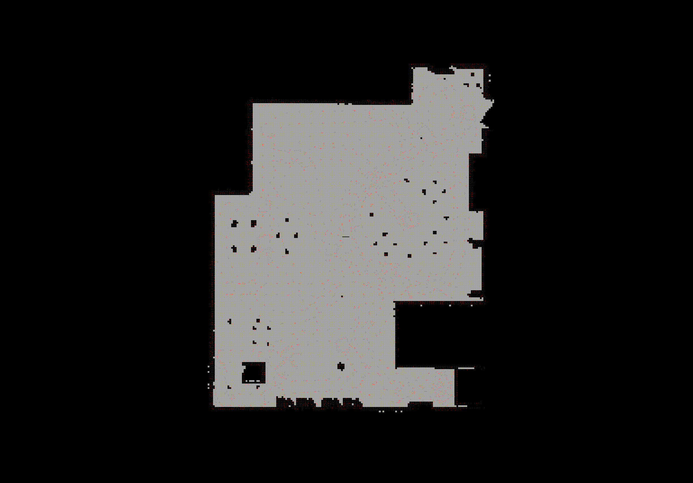

[Home](../../README.md) | Previous: [Where Am I?](../p3/p3-where-am-i.md)

# Project 4: Map My World

## Overview

This project is an implementation of Simultaneous Localization And Mapping (SLAM) in ROS with RTAB-Map.

__Mapping__ is the process of sketching an environment on the fly. The robot moves across the room and, via its sensors, collects data to incrementally build maps: LiDAR scans to generate a 2D occupancy grid, depth images to create a 3D point-cloud map. A loop closure mechanism is used to determine whether a location has been seen before. If an area already exists in the robot's database, based on the number of features extracted from a particular frame, then it is a known location and like images are merged to create a single, more refined view of that spot. Soon, the maps becomes robust and reliable. Feature extraction is performed via Speeded-Up Robust Feature (SURF).

__Pure Localization__ is the process of understanding if an area has already been explored. To perform pure localization (as in [Project 3](../p3/p3-where-am-i.md)), a pre-existing map is required: the map is generally loaded at inception, but its orientation is wrong until the robot recognizes — through a global loop closure — a landmark location present in its database, at which point the map correctly aligns with the environment.

Because SLAM is both a CPU and memory -intensive task, I designed a smaller, feature-rich house that could allow for fast, stable mapping resulting in a moderately-sized database. The outcome is overall very pleasing [Figure 1].

__Figure 1: The Redesigned World__


## Project Structure

The directory structure tree for this project appears in Figure 2. Worth of mention are the two launch files `mapping.launch` and `localization.launch` performing, respectively, SLAM and pure localization, and `rtabmap.db`, the generated map database of the environment (here, compressed and split into smaller archives of about 50MB each).

__Figure 2: Directory Structure Tree__

```bash
.
└── catkin_ws
    └── src
        └── my_robot
            ├── CMakeLists.txt
            ├── config
            │   └── mapmyworld_config.rviz
            ├── launch
            │   ├── localization.launch
            │   ├── mapping.launch
            │   ├── robot_description.launch
            │   ├── teleop.launch
            │   └── world.launch
            ├── maps
            │   └── rtabmap.db (.tar.xz.a*)
            ├── meshes
            │   ├── hokuyo.dae
            │   ├── my_coffee_table.dae
            │   └── my_curtain.dae
            ├── models
            │   └── ...
            ├── package.xml
            ├── urdf
            │   ├── my_robot.gazebo
            │   └── my_robot.xacro
            └── worlds
                ├── empty.world
                └── my_world.world
```

## Building the Project

RTAB-Map and associated visualization tool have [specific build requirements](p4-preliminary-config.md) that need to be met in order to run the project.

## Running the Project

To avoid continuous sourcing of the `setup.bash` script, append below two lines to `~/.bashrc`. The change will affect all newly-spawned terminal windows. `$ROS_DISTRO` will be automatically set to `noetic` at runtime.

```bash
source /opt/ros/$ROS_DISTRO/setup.bash
source ~/workspace/udacity-rsend/projects/p4/catkin_ws/devel/setup.bash
```

Then, open three terminal windows:

### First Terminal

```bash
roslaunch my_robot world.launch
```

As usual, this command will launch the Gazebo world and RViz with custom configuration. Heavy collada (.dae) objects like the window curtains will occasionally produce errors at this stage; if so, terminate the program (CTRL+C) and try again. If required, restart UTM.

### Second Terminal

```bash
roslaunch my_robot teleop.launch
```

This is a convenient wrapper for `teleop_twist_keyboard`.

### Third Terminal

To perform mapping (which creates a brand new database or overwrites the available one):

```bash
roslaunch my_robot mapping.launch
```

Equivalently, to perform pure localization with an existing database:

```bash
roslaunch my_robot localization.launch
```

These commands will display the environment map (or its visible portion, in case of mapping) in RViz, start the RTAB-Map SLAM algorithm and, unless commented-out, trigger the RTAB-Map visualization tool.

## Parameter Configuration

### Mapping

RTAB-Map has hundreds of parameters that can be fine-tuned to improve the performance of SLAM [1]. Since there are so many, the official documentation suggests to deviate from the default setup only if it does not yield good enough results [2]. From my experience, the default setting introduces some degree of distortion in the maps at loop closure, so I tried to reduce the bias by tightening the constraints on feature detection and visual odometry. Iterative Closest Point (ICP, `Reg/Strategy=1`), an alternative to visual scans, generally led to more stable and precise outcome [3]; however, it was not recommended in order to pass this project.

<table>
    <thead>
        <tr>
            <th>Type</th>
            <th>Parameter</th>
            <th>Value</th>
            <th>Rationale</th>
        </tr>
    </thead>
    <tbody>
        <tr>
            <td rowspan=1>RTAB-Map Parameters</td>
            <td><code>Rtabmap/DetectionRate</code></td>
            <td><code>1</code></td>
            <td>Rate (Hz) at which new nodes are added to map (1 Hz = 1 second).</td>
        </tr>
        <tr>
            <td rowspan=1>Memory</td>
            <td><code>Mem/NotLinkedNodesKept</code></td>
            <td><code>false</code></td>
            <td>Avoid registering new images if robot is not moving.</td>
        </tr>
        <tr>
            <td rowspan=2>Keypoint Memory</td>
            <td><code>Kp/MaxFeatures</code></td>
            <td><code>400</code></td>
            <td>Slightly reduce maximum number of features extracted from images.</td>
        </tr>
        <tr>
            <td><code>Kp/DetectorStrategy</code></td>
            <td><code>0</code></td>
            <td>Use SURF as loop closure detection strategy.</td>
        </tr>
        <tr>
            <td rowspan=1>Keypoint Descriptors and Detectors</td>
            <td><code>SURF/HessianThreshold</code></td>
            <td><code>100</code></td>
            <td>Used to extract more or less SURF features.</td>
        </tr>
        <tr>
            <td rowspan=1>RGBD-SLAM</td>
            <td><code>RGBD/LinearUpdate</code></td>
            <td><code>10</code></td>
            <td>Slightly increase linear displacement for map update (to 10 cm) to reduce computational burden.</td>
        </tr>
        <tr>
            <td rowspan=3>Odometry</td>
            <td><code>Odom/Holonomic</code></td>
            <td><code>false</code></td>
            <td>Account for a non-holonomic, skid-steer robot setup: y = x*tan(yaw).</td>
        </tr>
        <tr>
            <td><code>Odom/FilteringStrategy</code></td>
            <td><code>2</code></td>
            <td>Use particle filtering.</td>
        </tr>
        <tr>
            <td><code>Odom/ParticleSize</code></td>
            <td><code>120</code></td>
            <td>Set number of particles to 120 (which worked well for Project 3 "Where Am I?").</td>
        </tr>
        <tr>
            <td rowspan=2>Common Registration Parameters</td>
            <td><code>Reg/Strategy</code></td>
            <td><code>0</code></td>
            <td>Use visual-only loop closure constraint (disregard scans).</td>
        </tr>
        <tr>
            <td><code>Reg/Force3DoF</code></td>
            <td><code>true</code></td>
            <td> Perform 2D SLAM: only consider x, y, and yaw (disregard z, roll, and pitch).</td>
        </tr>
        <tr>
            <td rowspan=2>Visual Registration Parameters</td>
            <td><code>Vis/MinInliers</code></td>
            <td><code>35</code></td>
            <td>Increase minimum number of visual inliers to accept loop closure, for more robust matches.</td>
        </tr>
        <tr>
            <td><code>Vis/FeatureType</code></td>
            <td><code>0</code></td>
            <td>To enable <code>Mem/UseOdomFeatures</code>.</td>
        </tr>
        <tr>
            <td rowspan=4>Occupancy Grid</td>
            <td><code>Grid/Sensor</code></td>
            <td><code>0</code></td>
            <td>Construct occupancy grid map from laser scans (suppress warning).</td>
        </tr>
        <tr>
            <td><code>Grid/FootprintLength</code></td>
            <td><code>0.5</code></td>
            <td rowspan=3>Used to filter points over the footprint of the robot.</td>
        </tr>
        <tr>
            <td><code>Grid/FootprintWidth</code></td>
            <td><code>0.3</code></td>
        </tr>
        <tr>
            <td><code>Grid/FootprintHeight</code></td>
            <td><code>0.08</code></td>
        </tr>
        <tr>
            <td rowspan=2>Marker</td>
            <td><code>Marker/VarianceLinear</code></td>
            <td><code>0.001</code></td>
            <td rowspan=2>Minimize linear and angular variance on marker detections.</td>
        </tr>
        <tr>
            <td><code>Marker/VarianceAngular</code></td>
            <td><code>0.001</code></td>
        </tr>
    </tbody>
</table>

### Pure Localization

For pure localization, minor changes in the related launch file are needed:

* Remove `args="--delete_db_on_start"` when launching `rtabmap` to load a pre-existing map of the environment in RViz;
* Remove parameter `Mem/NotLinkedNodesKept`;
* Set `Mem/IncrementalMemory` to `false` to enable localization mode.

## Code Logic

### RQt Graph

The RQt graph for the project appears in Figure 3. RTAB-Map acquires data from (i.e., subscribes to) both laser scan (`/scan`) and RGB-D camera (`camera/rgb/image_raw` and `camera/depth/image_raw`) and publishes to topic `/map` to generate the maps. To operate the robot `/teleop_twist_keyboard` is used.

__Figure 3: RQt Graph__


### The Mapping Process

A small number of passes, at a slow linear and angular speed, is enough to create a satisfactory representation of the world. 

__Figure 4: Global Loop Closure Detection (Green Frame)__


### The Mapping Outcome

When assessing the quality of the maps, an important factor to consider is that the robot's RGB-D camera is located at 10 cm from the ground. Hence, the 2D occupancy grid only registers the _legs_ of tall objects like tables and chairs, since at that height the robot can traverse such objects freely [Figure 5]. The 3D view, instead, 

because even at long distances the robot is unable to collect data on high surfaces

In turn, 

The RGB-D camera is at 10 centimeters from the ground, 

The camera is located at 10 cm (?) from the ground, so even at a large distance the robot is unable to collect images on tall surfaces (which then result unmapped) or top of non-transparent.. As a consequence, the 2D grid only displays obstacles related to object legs (table, chairs) - this is how it should be as robot is able to traverse these objects freely - and the 3D map has several obscure areas (no info available). Nevertheless, the resulting images are quite precise. Also because the depth camera generates good images from a maximum distance of 4 meters, so going further than that will likely result in black pictures.

__Figure 5: 2D Occupancy Grid__


__Figure 6: 3D Point-Cloud Map__


### The Localization Process

Start from a random location. The map is visualized but does not appear to be allineated to the environment. Only after the robot reaches a spot it has already in memory (for example, the starting position in the database), a global loop closure is detected and the map aligns with the environment [Figure 7].

__Figure 7: Successful Robot Localization__


## Resources

1. https://github.com/introlab/rtabmap/blob/master/corelib/include/rtabmap/core/Parameters.h
2. https://github.com/introlab/rtabmap/wiki/Change-parameters
3. https://github.com/introlab/rtabmap/wiki/ICP

[Home](../../README.md) | Previous: [Where Am I?](../p3/p3-where-am-i.md)
