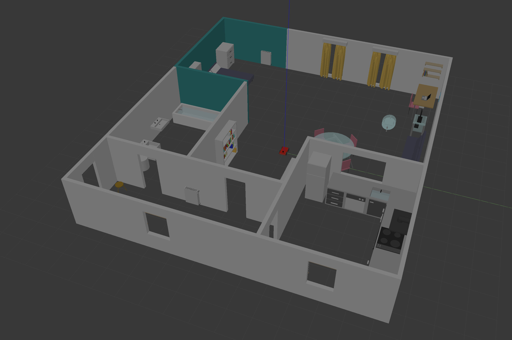
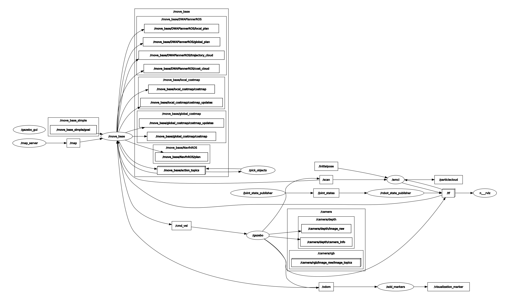
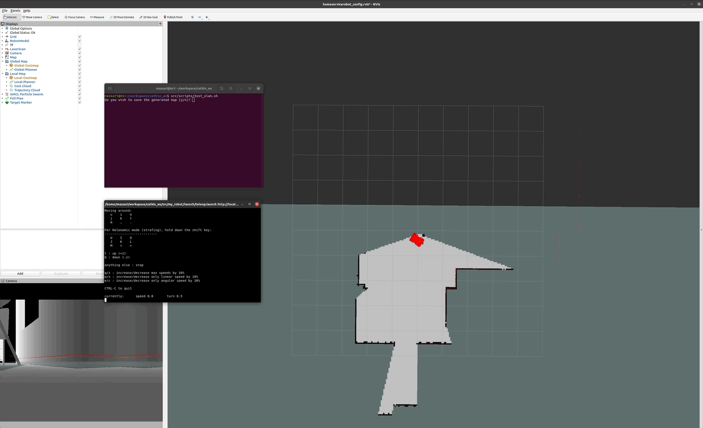

[Home](../../README.md) | Previous: [Map My World](../p4/p4-map-my-world.md)

# Project 5: Home Service Robot

## Overview

This capstone project combines SLAM, pure localization, navigation, and C++ programming of ROS nodes to deploy an autonomous robot that can fetch and deliver items in a custom Gazebo environment. The project builds on the experience gained in previous assignments, in particular:

- __SLAM__: The mapping task was similar to that of [Project 4](../p4/p4-map-my-world.md) (Map My World) but less computationally-intensive, since producing a 3D point-cloud view (which often made my VM crash with RTAB-Map) was not required this time. Hence, I could finally place the robot in my "real" home — no need to create an ad hoc smaller room to accommodate machine restrictions [Figure 1].

- __Pure Localization and Navigation__: The parameter calibration for these tasks was similar to, but much more involved than, that required for [Project 3](../p3/p3-where-am-i.md) (Where Am I?). Keeping the structure of the original launch and configuration files from the Turtlebot packages suggested by Udacity meant, for example, dealing with a considerably more complex ROS navigation stack.

- __Programming ROS Nodes in C++__: This final part of the assignment felt very much like working on [Project 2](../p2/p2-go-chase-it.md) (Go Chase It!) once again, with the logic of `pick_objects` and `add_markers` (the harder one) being very close to that of `drive_bot` and `process_image` respectively.

__Figure 1: My "Real" Virtual Home__


## Packages Used

<table>
    <thead>
        <tr>
            <th>Package</th>
            <th>Method</th>
            <th>Notes</th>
        </tr>
    </thead>
    <tbody>
        <tr>
            <td rowspan=1><code>teleop_twist_keyboard</code></td>
            <td>Full installation</td>
            <td>Used to manually teleoperate the robot during mapping via SLAM.</td>
        </tr>
        <tr>
            <td rowspan=1><code>slam_gmapping</code></td>
            <td>Full installation</td>
            <td>To create a 2D occupancy grid using laser and pose data during mapping via SLAM.</td>
        </tr>
        <tr>
            <td rowspan=1><code>turtlebot_apps/turtlebot_navigation</code></td>
            <td>Selected files</td>
            <td>To configure parameters of the localization (AMCL) and navigation (DWA) stack. To save map data in the <code>map</code> folder.</td>
        </tr>
    </tbody>
</table>

config
├── costmap_common_params.yaml
├── dwa_local_planner_params.yaml
├── global_costmap_params.yaml
├── local_costmap_params.yaml
├── move_base_params.yaml
└── navfn_global_planner_params.yaml

launch
├── amcl.launch
├── gmapping.launch
└── includes
    ├── amcl.launch.xml
    ├── gmapping.launch.xml
    └── move_base.launch.xml

Scrapped packages

- `teleop_twist_keyboard` — Used to manually teleoperate the robot during mapping via SLAM;
- `slam_gmapping` — To generate a 2D occupancy grid using laser and pose data during mapping via SLAM;
- `turtlebot_apps/turtlebot_navigation` — [1]

demos of map building using gmapping and localization with amcl, while running the navigation stack.

- `turtlebot_interactions/turtlebot_rviz_launchers` - [2]

__Figure 2: Directory Structure Tree__
```bash
.
└── catkin_ws
    └── src
        ├── CMakeLists.txt -> /opt/ros/noetic/share/catkin/cmake/toplevel.cmake
        ├── add_markers
        │   ├── CMakeLists.txt
        │   ├── include
        │   │   └── add_markers
        │   │       └── add_markers.h
        │   ├── package.xml
        │   └── src
        │       └── add_markers.cpp
        ├── map
        │   ├── map.pgm
        │   └── map.yaml
        ├── my_robot
        │   ├── CMakeLists.txt
        │   ├── config
        │   │   ├── costmap_common_params.yaml
        │   │   ├── dwa_local_planner_params.yaml
        │   │   ├── global_costmap_params.yaml
        │   │   ├── local_costmap_params.yaml
        │   │   ├── move_base_params.yaml
        │   │   └── navfn_global_planner_params.yaml
        │   ├── launch
        │   │   ├── amcl.launch
        │   │   ├── gmapping.launch
        │   │   ├── includes
        │   │   │   ├── amcl.launch.xml
        │   │   │   ├── gmapping.launch.xml
        │   │   │   └── move_base.launch.xml
        │   │   ├── robot_description.launch
        │   │   ├── teleop.launch
        │   │   └── world.launch
        │   ├── meshes
        │   │   ├── hokuyo.dae
        │   │   ├── my_coffee_table.dae
        │   │   └── my_curtain.dae
        │   ├── models
        │   │   └── ...
        │   ├── package.xml
        │   ├── urdf
        │   │   ├── my_robot.gazebo
        │   │   └── my_robot.xacro
        │   └── worlds
        │       ├── empty.world
        │       └── my_world.world
        ├── pick_objects
        │   ├── CMakeLists.txt
        │   ├── include
        │   │   └── pick_objects
        │   │       └── pick_objects.h
        │   ├── package.xml
        │   └── src
        │       └── pick_objects.cpp
        ├── rvizConfig
        │   └── homeservicerobot_config.rviz
        └── scripts
            ├── add_marker.sh
            ├── pick_objects.sh
            ├── test_navigation.sh
            └── test_slam.sh
```

## Challenges Faced

As opposed to previous projects, in which the biggest hardship was to make them work locally on Ubuntu 20.04 and ROS Noetic (building RTAB-Map with SURF in Project 4 [was really painful](../p4/p4-preliminary-config.md)), this one did not pose significant challenges. Some small hurdles:

### Getting Started

I was initially disappointed to find out the capstone project relied on Turtlebot and not on the robot I built and worked with since Project 2. Turtlebot and its variant Turtlebot 3 are difficult to build in ROS Noetic, for which no compatible version of related libraries such as `turtlebot_rviz_launchers` exists. Failed attempts at tackling the assignment included:

1. Trying to resolve dependencies locally by installing Noetic-compatible packages (whenever possible) or iteratively cloning the suggested repositories at each failed build, hoping the project will eventually compile successfully;

2. Scrapping the idea of running the Turtlebot project locally, and only relying on the Udacity workspace.

Finally, thanks to online posts, I realized it was feasible and actually encouraged to submit the project using my own world and robot [3] [4].

### RViz Configuration

Faithful reproduction in my custom environment of all the RViz displays that come with the Turtlebot navigation stack was not an easy feat, and it came from observing and mimicking the behaviour of the same components in the Udacity workspace setup. Only "Bumper Hit" was left out in the end, as it relies on the Turtlebot-specific `/mobile_base` topic.

### SLAM

Mapping table and chair legs in the 2D occupancy grid was surprising problematic, since additional passes in the same spot tended to wipe out at least some of the marks left by previous scans (a behaviour probably caused by map updates frequency) [Figure 3.A]. In the final grid, this area is actually an offline collage of shots from single passes taken at different angles in alternate maps.

### Localization and Navigation

Adapting Turtlebot configurations to my project was an opportunity to experiment with different algorithms like Dynamic Window Approach (DWA), but it was also a challenge due to the much larger number of parameters to calibrate. Fine tuning was luckily simplified thanks to the work done as part of Project 3, the option to recycle some of Turtlebot's default parameter values, and the availability of quality literature to review [5]. However, one major challenge came from the size of the cost cloud used for local planning: with 10 square meters (the original value for Project 3, calibrated for a much wider environment) the robot often got stuck when reaching the same y-coordinate of the goal but in a different room, with the red likelihood area spilling over to the inaccessible space and causing endless recalculation of the ideal trajectory [Figure 3.B]. It took me some time to understand how to resize the cloud and find the optimal value of 6 square meters.

<table>
  <tr>
  <td align="center"><b>Figure 3.A</b>: Wiped-out markers in the occupancy grid</td>
  <td align="center"><b>Figure 3.B</b>: Cost cloud size and robot indecisiveness</td>
  <tr>
  </tr>
  <tr>
    <td align="center"></td>
    <td align="center"></td>
  </tr>
</table>

### Custom C++ ROS Nodes

Understanding how to compile in the same node two `add_markers` files (time, odometry) each with its own `main` function but sharing the same header took some time, and came through close inspection of `CMakeLists.txt` in Project 2 as well as review of Udacity Knowledge answers [6].

### Testing in the Udacity Environment

URDF 1.7 (Gazebo 11, VM) and 1.6 (Gazebo 7, Udacity workspace) are not fully compatible and issues, mostly with objects pose, generally arise when retro-porting the Gazebo world ahead of project submission. Spawning the robot model inside the Gazebo world via ROS, saving the world including the robot, and manually removing the latter in the `.world` file helped resolve.

## Building and Running the Project

Install below dependencies, then build via `catkin_make`.

```bash
sudo apt-get install xterm
sudo apt install ros-$ROS_DISTRO-teleop-twist-keyboard
sudo apt install ros-$ROS_DISTRO-slam-gmapping
```

Shell scripts require execute permission:

```bash
cd src/scripts
chmod +x test_slam.sh test_navigation.sh pick_objects.sh add_marker.sh home_service.sh
```

To execute individual scripts from inside `catkin_ws` run:

```bash
./src/scripts/test_slam.sh
```

Each script
See individual script content

## Code Logic

### RQt Graph

The RQt graph for the project appears in Figure 4. It is considerably more involved than those of previous assignments, mainly due to the more complex navigation stack used.

__Figure 4: RQt Graph__


### Nodes

- `/move_base` supplies the 2D navigation logic, including local and global costmaps, local and global planners (DWA), and support for RViz displays (cost cloud and trajectory cloud). It subscribes to odometry and LiDAR data and publishes linear and angular velocities to the robot's wheels;

- `/amcl` provides the Adaptive Monte Carlo Localization logic. It subscribes to LiDAR scans and to an initial pose, and outputs a particle cloud estimating the robot's position and orientation in the environment;

- `/pick_objects` imparts two consecutive goals to the robot and subscribes to the navigation stack;

- `/add_markers` contains the logic to show and hide markers representing object pick-ups and drop-offs. It subscribes to odometry data to synchronise with `/pick_objects` and publishes a marker (manually added) to RViz.

### Phase 1: SLAM Testing

- The logic is contained in `test_slam.sh`
- 


A satisfactory output can be saved into the `map` folder from the main terminal.

__Figure 5: Environment Mapping__


### Phase 2: Localization and Navigation Testing

__Figure 6: Robot Navigation__


### Phase 3: 

## Resources

1. https://github.com/turtlebot/turtlebot_apps/tree/indigo/turtlebot_navigation
2. https://github.com/turtlebot/turtlebot_interactions/tree/indigo/turtlebot_rviz_launchers
3. https://knowledge.udacity.com/questions/903802
4. https://github.com/rst-tu-dortmund/teb_local_planner_tutorials/issues/6
5. Zheng, Kaiyu: "ROS Navigation Tuning Guide" (2019 revision) - [Link](https://kaiyuzheng.me/documents/navguide.pdf)
6. https://knowledge.udacity.com/questions/922035

[Home](../../README.md) | Previous: [Map My World](../p4/p4-map-my-world.md)
